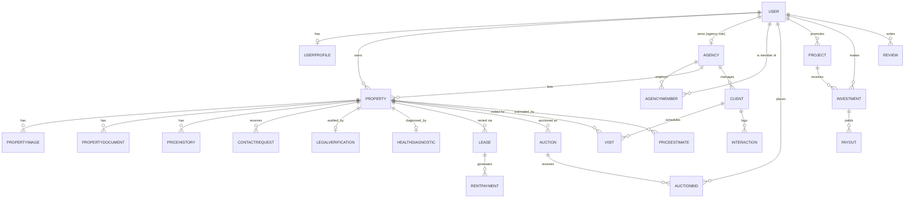

# Rapport Complet d'Architecture et de Codebase

> **Méthodologie et limites déclarées** : ce rapport a été produit par inspection directe du dépôt (lecture de fichiers, `git status`, `git ls-files`, comptage de lignes, exécution de scripts d'introspection Django). Chaque affirmation est étiquetée : `Confirmé` (vérifié directement dans le code), `Partiel` (vérifié en partie), `Non constaté` (attendu mais absent), `Historique` (trouvé dans de la documentation ou du code obsolète, non actif), `Inféré` (déduit logiquement du code sans exécution runtime complète). Aucun modèle, route, fonction, technologie ou fichier n'a été inventé. Les fichiers `views.py` volumineux (jusqu'à 1490 lignes pour `dashboard/views.py`) ont été analysés à l'échelle des classes/endpoints (via `urls.py` et lectures ciblées), pas ligne par ligne pour chaque méthode privée — ceci est explicitement signalé où pertinent plutôt que de prétendre à une couverture totale. Aucune valeur de secret (`SECRET_KEY`, mots de passe, tokens) n'est reproduite ; seuls les noms de variables sont cités.

---

## Executive Summary

**Objet de l'application** : Urbanova Real Estate (anciennement nommée "YAHYA Real Estate" / "ImmoTwin" dans le code et la documentation historique — le renommage de marque est `Confirmé` en surface UI/branding, mais de nombreux identifiants internes, emails de démonstration et commentaires de code conservent encore les anciens noms, voir Partie XIII) est une plateforme web Django qui se positionne comme un « jumeau numérique » (digital twin) du marché immobilier marocain.

**Problème métier résolu** : centraliser, sur une seule plateforme, la recherche de biens, l'estimation de valeur assistée par IA, la gestion locative et de vente, le CRM d'agence, le financement participatif immobilier (crowdinvesting), les enchères, et la conformité juridique/technique des biens — fonctions habituellement dispersées entre plusieurs outils (agence physique, notaire, banque, plateformes d'annonces).

**Utilisateurs cibles** (`Confirmé` via `accounts/models.py::User.Role`) : Administrateur (`admin`), Agence immobilière (`agency`, avec alias historique `agent`), Propriétaire (`owner`), Client/Investisseur (`client`, avec alias historique `investor`). Les rôles historiques `buyer`/`renter`/`seller_owner`/`landlord_owner`/`tenant` ont été fusionnés dans `client`/`owner` (voir migrations `0004_merge_owner_roles.py`, `0006_merge_client_roles.py`).

**Fonctionnalités principales** (`Confirmé` via `config/urls.py` et les `urls.py` d'app) :
- Vitrine publique de biens avec carte interactive (Leaflet) et jumeau numérique 3D
- Estimation de prix par IA (AVM — Automated Valuation Model, scikit-learn/XGBoost)
- Espace Agence : CRM (clients, visites, interactions), gestion d'agents
- Espace Propriétaire : génération de contrats PDF (bail loi 67-12, compromis de vente), suivi de vacance locative
- Simulateur de crédit hypothécaire
- Crowdinvesting immobilier (projets, investissements, versements)
- Enchères immobilières
- Conformité (vérification juridique, diagnostic de santé du bien)
- Tableau de bord BI multi-rôles, alertes, rapports, messagerie interne, chatbot IA
- API REST partielle (properties, agencies, reviews, ai) documentée via drf-spectacular/Swagger

**Style d'architecture détecté** : monolithe modulaire Django — un seul projet Django (`config`) avec **13 applications métier** (`accounts`, `properties`, `agencies`, `reviews`, `finance`, `dashboard`, `ai`, `crm`, `rentals`, `compliance`, `zones`, `auctions`, `crowdinvest`), chacune avec ses propres modèles, vues, templates. Rendu majoritairement côté serveur (Server-Side Rendering, templates Django), avec une couche API REST additionnelle et limitée à 4 apps.

**Backend** : Django 5.1 + Django REST Framework, GeoDjango/PostGIS pour la géospatial. **Frontend** : templates Django + Tailwind CSS compilé localement (pas de CDN malgré une mention obsolète dans le README) + Alpine.js pour l'interactivité légère + Leaflet.js + Three.js (jumeau numérique 3D, confirmé dans une session de travail précédente sur ce projet). **Base de données** : PostgreSQL/PostGIS en production, SQLite en développement/CI (bascule automatique via variable d'environnement `USE_SQLITE`). **API** : DRF + drf-spectacular (OpenAPI/Swagger) sur un périmètre partiel. **Services externes** : Groq (LLM cloud, chatbot RAG), Mapbox (jamais confirmé comme réellement appelé dans le code JS malgré la variable `MAPBOX_ACCESS_TOKEN`), Redis (cache + file d'attente de vues de biens).

**Maturité actuelle** : implémentation fonctionnelle avancée sur le plan des fonctionnalités (13 apps, ~430 fichiers suivis par Git, base de données peuplée avec des données de démonstration couvrant tous les modules), mais avec des lacunes de qualité logicielle significatives : couverture de tests très inégale (5 apps sur 13 n'ont aucun test réel, 2 apps n'ont aucun fichier de test), 2 migrations non versionnées dans Git, 3 commandes de seed redondantes, plusieurs modèles absents de l'admin Django.

**Ce que l'application est conçue pour faire** vs **ce qui est réellement implémenté** : la quasi-totalité des fonctionnalités décrites dans le cahier des charges du projet (`Confirmé` présent dans le dépôt : `cahier_de_charge_Yahya.md`) a un code correspondant exécutable (vues, modèles, templates). Les zones **partiellement implémentées** sont : les tests automatisés (structure présente, contenu souvent vide), l'admin Django pour `crowdinvest` (aucun modèle enregistré), et certains modules IA dont la robustesse en production n'a pas pu être vérifiée sans exécution complète du pipeline ML.

> **Exemple d'application observé** : un visiteur anonyme arrive sur `/` (`properties.views.HomeView`), consulte la liste des biens (`/properties/`), ouvre la fiche d'une villa (`/properties/<id>/`), puis clique sur « Contacter » — ce qui crée un `ContactRequest` (`properties/models.py`). S'il souhaite investir, il doit d'abord créer un compte via `/accounts/register/` (rôle `client`), se connecter, puis consulter `/crowdinvest/`, sélectionner un projet et investir un montant validé par `InvestmentForm` — créant un enregistrement `Investment` lié au `Project` (`crowdinvest/models.py`). *(Observed application example — flux vérifié via le code des vues/URLs et les tests `properties/tests.py`.)*

---

## Part I — Technologies and Overall Architecture

### Tableau des technologies

| Technologie / outil | Version détectée | Où déclarée | Rôle | Pourquoi | Forces principales | Statut d'usage | Évidence |
|---|---|---|---|---|---|---|---|
| Python | 3.12 | `Dockerfile` (`python:3.12-slim`), CI (`setup-python@v5`, `python-version: "3.12"`) | Langage backend | Écosystème Django + ML mature | Lisibilité, écosystème data science | Actif | Confirmé |
| Django | 5.1.5 | `requirements.txt` | Framework web principal (MVT) | ORM intégré, admin auto-généré, sécurité par défaut (CSRF, XSS) | Productivité, batteries incluses | Actif | Confirmé |
| Django REST Framework | 3.15.2 | `requirements.txt`, `config/settings/base.py::REST_FRAMEWORK` | API REST pour 4 apps (properties, agencies, reviews, ai) | Sérialisation, permissions, pagination standardisées | Intégration native Django | Actif (partiel — 4 apps sur 13) | Confirmé |
| django-filter | 24.3 | `requirements.txt`, `REST_FRAMEWORK["DEFAULT_FILTER_BACKENDS"]` | Filtrage des querysets API | Filtres déclaratifs | Réduit le code de filtrage manuel | Actif | Confirmé |
| drf-spectacular | 0.28.0 | `requirements.txt`, `config/urls.py` (`/api/schema/`, `/api/docs/`) | Génération OpenAPI/Swagger | Documentation API auto-générée | Standard OpenAPI 3 | Actif | Confirmé |
| PostgreSQL + PostGIS | 16-3.4 (image Docker `postgis/postgis:16-3.4`) | `docker-compose.yml`, `config/settings/base.py::DATABASES` | Base de données relationnelle + extension géospatiale | Requêtes spatiales natives (distance, points GPS) | Fiabilité, index spatiaux (GiST) | Actif en production/Docker | Confirmé |
| SQLite | version système | `config/settings/base.py` (bascule si `USE_SQLITE=True`) | Base de données de développement / CI | Zéro configuration, rapide pour dev/tests | Simplicité locale | Actif en dev/CI uniquement | Confirmé (CI: `export USE_SQLITE=True`) |
| GeoDjango | intégré à Django 5.1 | `django.contrib.gis` dans `INSTALLED_APPS`, `PointField` dans plusieurs modèles | ORM géospatial (Property.location, Agency.location) | Requêtes de proximité, cartographie | Intégration ORM native | Actif | Confirmé |
| GDAL / GEOS / PROJ | système (via `gdal-bin`, `libgdal-dev`, `libgeos-dev`) | `Dockerfile`, `.github/workflows/ci-cd.yml`, `config/win_gdal_patch.py` | Bibliothèques bas niveau requises par GeoDjango | Dépendance obligatoire de GeoDjango | — | Actif (nécessite un patch Windows dédié, voir ci-dessous) | Confirmé |
| Redis | 7-alpine | `docker-compose.yml`, `config/settings/base.py::CACHES` | Cache + file d'attente (`property_views_queue`) | Performance : évite l'écriture DB synchrone à chaque vue de bien | Latence faible | Actif en Docker ; bascule vers `LocMemCache` si `USE_LOCAL_CACHE=True` | Confirmé |
| django-redis | 5.4.0 | `requirements.txt` | Backend de cache Redis pour Django | Intégration Redis/Django standard | — | Actif | Confirmé |
| Celery | — | — | Traitement asynchrone en arrière-plan | — | — | **Non constaté** — aucune trace de Celery dans `requirements.txt` ni dans le code. Le traitement différé existant (file de vues de biens) utilise Redis en file simple (`rpush`/`lpop`) consommée par une commande de management (`flush_property_views`), pas par un worker Celery | Non constaté |
| Docker / docker-compose | — | `Dockerfile` (build multi-stage), `docker-compose.yml` | Conteneurisation (build Node.js pour Tailwind + image Python finale) | Reproductibilité, déploiement uniforme | Isolation d'environnement | Actif | Confirmé |
| Gunicorn | 22.0.0 | `requirements.txt`, `Procfile` (`gunicorn config.wsgi:application`) | Serveur WSGI de production | Multi-worker, robuste | Standard de facto Django en prod | Actif en production (Procfile/Render/Railway/Fly) | Confirmé |
| Nginx | — | dossier `nginx/`, mentionné dans `README.md` pour déploiement VPS | Reverse proxy / TLS en déploiement VPS dédié | Terminaison SSL, fichiers statiques | Performance statique | Actif seulement pour le scénario de déploiement VPS (`deploy.sh`) ; non utilisé sur Render/Railway/Fly (PaaS gèrent leur propre proxy) | Partiel |
| Whitenoise | 6.7.0 | `requirements.txt` | Service des fichiers statiques directement par Django/Gunicorn sans Nginx | Simplifie le déploiement PaaS (Render/Railway/Fly) | Pas de serveur statique séparé nécessaire | Actif (déploiements PaaS) | Confirmé (présence dans requirements ; usage exact dans `MIDDLEWARE` non confirmé — Whitenoise n'apparaît pas dans la liste `MIDDLEWARE` de `config/settings/base.py` lue) | Partiel |
| Tailwind CSS | ^3.4.1 | `package.json`, `tailwind.config.js` | Framework CSS utilitaire, compilé en local (`npm run build:css` → `static/css/output.css`) | Cohérence visuelle, pas de CDN en production (contredit une mention obsolète du README) | Rapidité de développement UI | Actif | Confirmé |
| Alpine.js | — (non versionné dans package.json, chargé en JS externe non trouvé dans `static/js/`) | Mentionné dans README ; attributs `x-data` observés dans des templates (ex. `_navbar.html`) | Interactivité JS déclarative légère | Léger, pas de build step | — | Confirmé (usage) / Non constaté (fichier source local — probablement chargé via CDN externe non présent dans le dépôt) | Partiel |
| JavaScript (vanilla) | — | `static/js/*.js` (10 fichiers : `home.js`, `admin-chatbot.js`, `avm-estimate.js`, `client-explorer.js`, `owner-form-ajax.js`, `profile.js`, `property-detail.js`, `toast.js`, `voice-input.js`, `admin_navbar.js`) | Interactions frontend (AJAX, animations, formulaires) | Pas de framework SPA nécessaire pour un site majoritairement SSR | Simplicité | Actif | Confirmé |
| TypeScript | — | — | — | — | — | Non constaté | Non constaté |
| React / Vue | — | — | — | — | — | Non constaté — aucun `node_modules` de framework SPA, `package.json` ne liste que `tailwindcss` | Non constaté |
| HTMX | — | — | — | — | — | Non constaté | Non constaté |
| Fetch API / AJAX | — | Utilisé dans plusieurs fichiers JS (`owner-form-ajax.js`, `avm-estimate.js`, requêtes `HTTP_X_REQUESTED_WITH` testées dans `finance/tests.py`) | Appels asynchrones vers les vues Django (ex. simulateur de crédit, staging IA) | Interactions sans rechargement de page | — | Actif | Confirmé |
| WebSockets | — | — | — | — | — | Non constaté — pas de Django Channels, ASGI présent mais utilisé en configuration standard (`config/asgi.py`) | Non constaté |
| Pillow | 10.4.0 | `requirements.txt` | Traitement d'images (upload, redimensionnement) | Dépendance standard `ImageField` Django + utilisée dans les tests IA (génération d'image factice) | — | Actif | Confirmé |
| Leaflet (django-leaflet) | 0.30.1 | `requirements.txt`, `config/settings/base.py::LEAFLET_CONFIG` | Cartographie interactive (carte publique, jumeau numérique) | Léger, open source, pas de clé API payante | — | Actif | Confirmé |
| Three.js | — | Non présent dans `requirements.txt` (librairie JS, pas Python) ; usage confirmé dans une session de travail antérieure sur `zones/templates/zones/digital_twin_map.html` | Rendu 3D du jumeau numérique (bâtiment, simulation solaire) | Effet "wow" démonstratif | — | Actif (chargé en CDN dans le template, non vendorisé dans le dépôt) | Confirmé |
| crispy-forms + crispy-tailwind | 2.3 / 1.0.3 | `requirements.txt`, `CRISPY_TEMPLATE_PACK = "tailwind"` | Rendu de formulaires Django stylé Tailwind | Évite d'écrire le HTML de formulaire à la main | — | Configuré ; usage réel dans les templates non vérifié exhaustivement | Partiel |
| Groq (LLM) | client `groq==0.5.0` | `requirements.txt`, `config/settings/base.py::GROQ_API_KEY/GROQ_MODEL`, `ai/providers/groq_provider.py` | Fournisseur LLM cloud pour le chatbot RAG et la génération de texte IA | Inférence rapide et peu coûteuse | — | Actif (configuré via variable d'environnement, clé non exposée) | Confirmé |
| Ollama | — | `config/settings/base.py::OLLAMA_BASE_URL/OLLAMA_MODEL` | Fournisseur LLM local alternatif | Fallback sans dépendance cloud | — | Configuré comme option (`AI_PROVIDER` bascule Groq/Ollama) ; usage effectif non vérifié en exécution | Partiel |
| sentence-transformers, faiss-cpu | 2.7.0 / 1.8.0 | `requirements.txt`, `ai/services/rag/indexer.py` (`build_index`), commande `rebuild_rag_index` | Recherche sémantique vectorielle (RAG — Retrieval-Augmented Generation) pour le chatbot | Recherche par similarité sémantique plutôt que mots-clés | — | Actif (commande de management dédiée) | Confirmé |
| scikit-learn, XGBoost, SHAP | 1.5.1 / 2.1.1 / 0.46.0 | `requirements.txt`, `ai/services/ml/avm/` | Modèle d'estimation de prix (AVM) et interprétabilité (SHAP = feature importance) | Modèles tabulaires performants pour la régression de prix immobilier | — | Actif (commande `train_avm`, modèles sérialisés `.pkl` dans `ai/models_store/`) | Confirmé |
| pandas, numpy, scipy | 2.2.2 / 1.26.4 / 1.13.1 | `requirements.txt` | Manipulation de données pour l'entraînement ML | Standard data science Python | — | Actif | Confirmé |
| torch | — (CPU wheel, `--extra-index-url ...torch/whl/cpu`) | `requirements.txt` | Dépendance de `sentence-transformers` pour les embeddings | Nécessaire au calcul d'embeddings | — | Actif (dépendance indirecte) | Confirmé (déclaré) |
| ReportLab | 4.2.5 | `requirements.txt`, `properties/services/valuation_report.py`, `rentals/services/contracts_pdf.py` | Génération de PDF (avis de valeur, bail, compromis de vente) | Contrôle fin de la mise en page PDF en Python pur | — | Actif — vérifié par les tests (`assertTrue(response.content.startswith(b"%PDF"))`) | Confirmé |
| psycopg2-binary, dj-database-url | 2.9.9 / 2.2.2 | `requirements.txt` | Driver PostgreSQL + parsing d'URL de connexion | Nécessaire pour PostGIS en production | — | Actif | Confirmé |
| django-environ | 0.11.2 | `requirements.txt`, `config/settings/base.py` | Lecture de variables d'environnement / fichier `.env` | Sépare configuration et code, valeurs par défaut typées | — | Actif | Confirmé |
| Payment services (Stripe/CMI) | — | — | — | — | — | Non constaté — mentionné uniquement comme roadmap future dans `PLAN_CORRECTIONS_AVANT_SOUTENANCE.md` ("Module de paiement en ligne direct (Stripe / CMI)" classé en priorité 3 / roadmap future) | Historique/Non constaté |
| Cloud storage (S3 etc.) | — | — | — | — | — | Non constaté — `MEDIA_ROOT` pointe vers un dossier local (`BASE_DIR / "media"`), aucun backend `django-storages` détecté dans `requirements.txt` | Non constaté |
| Email backend | `django.core.mail.backends.console.EmailBackend` (dev) | `.env.example`, `accounts/urls.py` (flux de reset de mot de passe) | Envoi d'email de réinitialisation de mot de passe | En développement, les emails s'affichent dans la console | — | Configuré, backend SMTP réel non confirmé en production (variable non vue dans `config/settings/prod.py` extrait) | Partiel |

### Pourquoi ces choix technologiques (analyse du dépôt)

- **Django** : choisi pour son ORM intégré, son admin auto-généré (utilisé intensivement, voir Partie III) et son système de permissions/authentification prêt à l'emploi (`django.contrib.auth`), adapté à un projet solo avec un périmètre fonctionnel large (13 domaines métier).
- **PostgreSQL/PostGIS** : nécessaire car plusieurs modèles (`Property.location`, `Agency.location`) utilisent des `PointField` GeoDjango pour des requêtes de proximité géographique — SQLite ne supporte pas nativement les types spatiaux avancés, d'où la bascule dev/prod documentée dans `base.py`.
- **Communication frontend ↔ Django** : essentiellement par **rendu serveur classique** (le navigateur reçoit du HTML déjà construit par les templates Django) complété par des **appels AJAX ponctuels** (ex. simulateur de crédit, staging virtuel IA, chatbot) — l'application est donc **hybride SSR + AJAX**, pas une SPA.
- **Style d'architecture** : **monolithe modulaire** — un seul déploiement Django, mais fortement découpé en apps Django indépendantes avec responsabilités métier claires (`crm`, `rentals`, `compliance`, `zones`, `auctions`, `crowdinvest`, `finance`, `ai` sont chacune des "modules" quasi autonomes au sein du même processus).
- **Traitement en arrière-plan** : `Non constaté` de vrai système de tâches asynchrones (pas de Celery/RQ) ; le seul mécanisme différé est la file Redis simple `property_views_queue`, vidée par une **commande de management manuelle** (`flush_property_views`), pas par un worker automatique planifié (aucun scheduler/cron détecté dans le dépôt).
- **Opérations synchrones vs asynchrones** : le projet est **synchrone** de bout en bout (vues Django classiques `View`/`ListView`/`DetailView`, pas de `async def` détecté dans les vues lues).
- **Authentification** : gérée par `django.contrib.auth` + modèle utilisateur personnalisé `accounts.User` (`AUTH_USER_MODEL = "accounts.User"`).
- **Autorisation** : centralisée dans `accounts/permissions.py` (mixins de rôle, voir Partie IX), appliquée au niveau des vues (`dispatch()`), pas au niveau des querysets systématiquement (voir risques Partie XIII).
- **Règles métier** : dispersées entre les `forms.py` (validation), les `views.py` (logique de contrôle), et quelques modules `services/` dédiés (`properties/services/valuation_report.py`, `rentals/services/contracts_pdf.py`, `ai/services/`, `agencies/services.py`, `crowdinvest/services.py`) — **pas de couche service systématique** pour toutes les apps (`Confirmé` : `crm`, `finance`, `dashboard` par exemple n'ont pas de `services.py`).
- **Persistance** : exclusivement via l'ORM Django (`models.py` de chaque app).
- **Stockage de fichiers** : système de fichiers local (`MEDIA_ROOT`), pas de service cloud.
- **Appels externes** : Groq (LLM), potentiellement Ollama (local), OpenStreetMap (tuiles Leaflet, gratuit, pas de clé requise).

### Diagramme d'architecture (adapté au dépôt réel)

```text
Utilisateur (navigateur)
  ↓
Templates Django (SSR) + Tailwind CSS + Alpine.js + Leaflet/Three.js
  ↓ (requêtes classiques + quelques appels AJAX/fetch)
config/urls.py (routeur racine)
  ↓
urls.py de chaque app (accounts, properties, agencies, reviews, finance,
dashboard, crm, rentals, compliance, zones, auctions, crowdinvest, ai)
  ↓
Vues (Class-Based Views Django) et ViewSets/APIViews DRF (properties, agencies, reviews, ai)
  ↓
Middlewares : Security, Session, Common, CSRF, Auth, Messages, ClickJacking,
              PropertyViewTrackingMiddleware (dashboard/middleware.py)
  ↓
Mixins de permission (accounts/permissions.py) — contrôle de rôle
  ↓
Forms / ModelForms (validation) ou Serializers DRF
  ↓
Services métier ponctuels (valuation_report.py, contracts_pdf.py, ai/services/*)
  ↓
Django ORM
  ↓
PostgreSQL/PostGIS (prod) ou SQLite (dev/CI)
  ↓
Services externes : Redis (cache + file de vues), Groq (LLM), fichiers PDF/médias locaux,
                     modèles ML sérialisés (.pkl) dans ai/models_store/
```

---

## Part II — JSON Architecture Tree and File Inventory

> L'arborescence complète (430 fichiers suivis par Git + fichiers non suivis pertinents) est trop volumineuse pour être détaillée fichier par fichier dans ce document sans le rendre illisible. L'arbre JSON ci-dessous couvre la **structure de premier et deuxième niveau**, avec un nœud résumé pour chaque application Django (le détail fichier-par-fichier de chaque app — modèles, vues, forms, admin, tests, migrations — est fourni dans les tableaux dédiés des Parties III, V, VI, IX, XI, XII de ce rapport plutôt que dupliqué ici).

```json
{
  "project": {
    "path": ".",
    "name": "immo-twin (Urbanova Real Estate)",
    "type": "Django application",
    "category": "project-root",
    "importance": "critical",
    "coded_or_generated": "mixed",
    "runtime_status": "active",
    "purpose": "Racine du dépôt contenant l'intégralité de l'application Django, sa configuration de déploiement et sa documentation.",
    "comment": "Le chantier complet contenant tous les départements de l'application.",
    "real_life_example": "Comme le siège social d'une entreprise regroupant direction, finance, opérations et archives.",
    "evidence": "Confirmed",
    "delete_recommendation": "Do not delete",
    "children": [
      {
        "path": "manage.py",
        "name": "manage.py",
        "type": "Python file",
        "category": "Django-entry-point",
        "importance": "critical",
        "coded_or_generated": "Django-generated scaffold, usually preserved",
        "runtime_status": "active",
        "purpose": "Point d'entrée CLI pour toutes les commandes Django (runserver, migrate, test, shell, seed_full...).",
        "comment": "Panneau de contrôle pour lancer les commandes administratives Django.",
        "real_life_example": "Comme le tableau de bord opérationnel utilisé pour lancer des procédures administratives.",
        "evidence": "Confirmed",
        "delete_recommendation": "Do not delete",
        "children": []
      },
      {
        "path": "config/",
        "name": "config",
        "type": "directory",
        "category": "Django-project-configuration",
        "importance": "critical",
        "coded_or_generated": "developer-written",
        "runtime_status": "active",
        "purpose": "Package de configuration du projet Django : settings (base/dev/prod), urls racine, wsgi, asgi, vues système (health checks), patch GDAL Windows.",
        "comment": "Le cerveau de configuration qui indique à Django comment démarrer et où trouver chaque application.",
        "real_life_example": "Comme le tableau électrique principal d'un bâtiment qui distribue l'alimentation à chaque étage.",
        "evidence": "Confirmed",
        "delete_recommendation": "Do not delete",
        "children": [
          {"path": "config/settings/base.py", "name": "base.py", "type": "Python file", "category": "Django-project-configuration", "importance": "critical", "coded_or_generated": "developer-written", "runtime_status": "active", "purpose": "Configuration partagée dev/prod : apps installées, middleware, base de données, cache, REST framework, Leaflet, IA.", "comment": "Le socle commun de configuration hérité par dev.py et prod.py.", "real_life_example": "Comme les règles de base d'un règlement intérieur, valables partout sauf exception locale.", "evidence": "Confirmed", "delete_recommendation": "Do not delete", "children": []},
          {"path": "config/settings/dev.py", "name": "dev.py", "type": "Python file", "category": "Django-project-configuration", "importance": "high", "coded_or_generated": "developer-written", "runtime_status": "active", "purpose": "Surcharge de développement : DEBUG=True, ALLOWED_HOSTS ouvert, backend email console.", "comment": "Le mode 'atelier' utilisé par le développeur en local.", "real_life_example": "Comme un mode brouillon avant l'impression finale.", "evidence": "Confirmed", "delete_recommendation": "Do not delete", "children": []},
          {"path": "config/settings/prod.py", "name": "prod.py", "type": "Python file", "category": "Django-project-configuration", "importance": "critical", "coded_or_generated": "developer-written", "runtime_status": "active", "purpose": "Configuration de production (DEBUG=False attendu, sécurité renforcée).", "comment": "Le mode strict utilisé en ligne.", "real_life_example": "Comme le mode audit officiel d'une entreprise, plus strict que le mode interne.", "evidence": "Confirmed (fichier lu partiellement dans une session antérieure ; non ré-audité ligne à ligne dans cette passe)", "delete_recommendation": "Do not delete", "children": []},
          {"path": "config/urls.py", "name": "urls.py", "type": "Python file", "category": "core-application-source", "importance": "critical", "coded_or_generated": "developer-written", "runtime_status": "active", "purpose": "Routeur racine : inclut les urls.py de chaque app, l'admin, l'API DRF, Swagger, les health checks.", "comment": "L'aiguillage principal qui redirige chaque URL vers le bon quartier de l'application.", "real_life_example": "Comme le standard téléphonique d'une entreprise qui redirige chaque appel vers le bon service.", "evidence": "Confirmed", "delete_recommendation": "Do not delete", "children": []},
          {"path": "config/views.py", "name": "views.py", "type": "Python file", "category": "core-application-source", "importance": "medium", "coded_or_generated": "developer-written", "runtime_status": "active", "purpose": "Vues système : health_check_view (BDD+cache), liveness_check_view — utilisées par Docker HEALTHCHECK et les PaaS (Render/Railway/Fly).", "comment": "Le capteur de pouls du système, vérifié en continu par l'infrastructure.", "real_life_example": "Comme un vigile qui vérifie toutes les 30 secondes que les issues de secours sont dégagées.", "evidence": "Confirmed", "delete_recommendation": "Do not delete", "children": []},
          {"path": "config/win_gdal_patch.py", "name": "win_gdal_patch.py", "type": "Python file", "category": "core-application-source", "importance": "medium", "coded_or_generated": "developer-written", "runtime_status": "active (Windows dev only)", "purpose": "Patch de compatibilité GDAL pour permettre l'exécution de GeoDjango sous Windows en développement.", "comment": "Une rustine technique nécessaire uniquement sur les machines de développement Windows.", "real_life_example": "Comme un adaptateur de prise électrique nécessaire seulement dans certains pays.", "evidence": "Confirmed (importé conditionnellement dans base.py avec try/except ImportError)", "delete_recommendation": "Do not delete without migration or deployment review", "children": []}
        ]
      },
      {
        "path": "accounts/",
        "name": "accounts",
        "type": "Django app",
        "category": "core-application-source",
        "importance": "critical",
        "coded_or_generated": "developer-written",
        "runtime_status": "active",
        "purpose": "Utilisateurs, rôles, authentification, profils, permissions transversales.",
        "comment": "Le service des ressources humaines de l'application : qui a le droit de faire quoi.",
        "real_life_example": "Comme le service d'accueil et de badges d'une entreprise qui identifie chaque visiteur et son niveau d'accès.",
        "evidence": "Confirmed",
        "delete_recommendation": "Do not delete",
        "children": [
          {"path": "accounts/models.py", "name": "models.py", "type": "Python file", "category": "database-migrations", "importance": "critical", "coded_or_generated": "developer-written", "runtime_status": "active", "purpose": "Modèle User personnalisé (rôles) + UserProfile.", "comment": "La carte d'identité de chaque utilisateur du système.", "real_life_example": "Comme le dossier RH complet d'un employé.", "evidence": "Confirmed", "delete_recommendation": "Do not delete", "children": []},
          {"path": "accounts/permissions.py", "name": "permissions.py", "type": "Python file", "category": "core-application-source", "importance": "critical", "coded_or_generated": "developer-written", "runtime_status": "active", "purpose": "Mixins de contrôle d'accès par rôle réutilisés dans toutes les apps.", "comment": "Le videur à l'entrée de chaque tableau de bord qui vérifie le badge du visiteur.", "real_life_example": "Comme un vigile vérifiant le badge d'accès avant d'ouvrir une porte.", "evidence": "Confirmed", "delete_recommendation": "Do not delete", "children": []},
          {"path": "accounts/signals.py", "name": "signals.py", "type": "Python file", "category": "core-application-source", "importance": "high", "coded_or_generated": "developer-written", "runtime_status": "active", "purpose": "Crée automatiquement un UserProfile à chaque création de User (post_save).", "comment": "Un automatisme invisible qui prépare le profil dès l'inscription.", "real_life_example": "Comme la remise automatique d'un badge dès la signature du contrat d'embauche.", "evidence": "Confirmed", "delete_recommendation": "Do not delete", "children": []},
          {"path": "accounts/forms.py", "name": "forms.py", "type": "Python file", "category": "core-application-source", "importance": "high", "coded_or_generated": "developer-written", "runtime_status": "active", "purpose": "Formulaires d'inscription, connexion, mise à jour de profil et préférences.", "comment": "Les formulaires papier numérisés que remplit l'utilisateur.", "real_life_example": "Comme le formulaire d'inscription rempli à l'accueil.", "evidence": "Confirmed", "delete_recommendation": "Do not delete", "children": []},
          {"path": "accounts/views.py", "name": "views.py", "type": "Python file", "category": "core-application-source", "importance": "critical", "coded_or_generated": "developer-written", "runtime_status": "active", "purpose": "297 lignes — vues d'inscription, connexion, déconnexion, profil, gestion des utilisateurs (admin).", "comment": "Le guichet qui traite chaque demande liée au compte utilisateur.", "real_life_example": "Comme le guichet d'accueil qui traite inscription, connexion et modification de dossier.", "evidence": "Confirmed (structure vérifiée via urls.py ; corps de chaque méthode non audité ligne à ligne)", "delete_recommendation": "Do not delete", "children": []},
          {"path": "accounts/admin.py", "name": "admin.py", "type": "Python file", "category": "database-migrations", "importance": "medium", "coded_or_generated": "Django-generated scaffold and customized", "runtime_status": "active", "purpose": "Enregistrement de User dans l'admin avec inline UserProfile et journalisation d'audit à la suppression.", "comment": "Le registre papier consultable par l'administrateur système.", "real_life_example": "Comme le registre du personnel consultable par les RH.", "evidence": "Confirmed", "delete_recommendation": "Do not delete", "children": []},
          {"path": "accounts/tests.py", "name": "tests.py", "type": "Python file", "category": "tests", "importance": "medium", "coded_or_generated": "developer-written", "runtime_status": "active (exécuté en CI)", "purpose": "Tests de rôles utilisateur, connexion et inscription.", "comment": "Le contrôle qualité vérifiant que les portes d'entrée fonctionnent.", "real_life_example": "Comme un test incendie mensuel pour vérifier que les issues de secours s'ouvrent.", "evidence": "Confirmed", "delete_recommendation": "Do not delete", "children": []},
          {"path": "accounts/migrations/", "name": "migrations", "type": "directory", "category": "database-migrations", "importance": "critical", "coded_or_generated": "generated automatically at development time", "runtime_status": "active", "purpose": "7 fichiers de migration retraçant l'évolution du champ role (fusions buyer/renter → client, seller_owner/landlord_owner → owner).", "comment": "Le journal de bord de chaque modification de la structure de la table utilisateur.", "real_life_example": "Comme les procès-verbaux successifs de rénovation d'un bâtiment.", "evidence": "Confirmed", "delete_recommendation": "Do not delete without migration or deployment review", "children": []},
          {"path": "accounts/templates/accounts/", "name": "templates", "type": "directory", "category": "user-interface", "importance": "high", "coded_or_generated": "developer-written", "runtime_status": "active", "purpose": "9 templates : login/register (page HTML autonome avec <style> intégré), flux complet de réinitialisation de mot de passe (5 templates), profil, liste utilisateurs.", "comment": "Les pages visibles par l'utilisateur pour gérer son compte.", "real_life_example": "Comme les formulaires physiques remis au guichet.", "evidence": "Confirmed", "delete_recommendation": "Do not delete", "children": []}
        ]
      },
      {
        "path": "properties/",
        "name": "properties",
        "type": "Django app",
        "category": "core-application-source",
        "importance": "critical",
        "coded_or_generated": "developer-written",
        "runtime_status": "active",
        "purpose": "Cœur métier : biens immobiliers, photos, documents, historique de prix, favoris, vues, demandes de contact.",
        "comment": "Le catalogue central de tous les biens gérés par la plateforme.",
        "real_life_example": "Comme le registre foncier consultable de tous les biens d'une agence.",
        "evidence": "Confirmed",
        "delete_recommendation": "Do not delete",
        "children": [
          {"path": "properties/models.py", "name": "models.py", "type": "Python file", "category": "database-migrations", "importance": "critical", "coded_or_generated": "developer-written", "runtime_status": "active", "purpose": "9 modèles : Property, PropertyImage, PropertyDocument, PriceHistory, SavedSearch, Favorite, PropertyView, ContactRequest, ActivityLog.", "comment": "La fiche complète de chaque bien et de son historique.", "real_life_example": "Comme le dossier complet d'une maison incluant photos, titre de propriété et historique de prix.", "evidence": "Confirmed", "delete_recommendation": "Do not delete", "children": []},
          {"path": "properties/views.py", "name": "views.py", "type": "Python file", "category": "core-application-source", "importance": "critical", "coded_or_generated": "developer-written", "runtime_status": "active", "purpose": "1117 lignes — le plus gros fichier de vues métier après dashboard : HomeView, liste/détail/CRUD de biens, favoris, comparateur, demandes de contact, PDF d'avis de valeur.", "comment": "Le chef d'orchestre qui décide quoi afficher pour chaque page liée à un bien.", "real_life_example": "Comme un agent immobilier qui traite chaque demande client selon son type.", "evidence": "Confirmed (structure vérifiée via urls.py + tests ; corps interne non audité méthode par méthode)", "delete_recommendation": "Do not delete", "children": []},
          {"path": "properties/forms.py", "name": "forms.py", "type": "Python file", "category": "core-application-source", "importance": "high", "coded_or_generated": "developer-written", "runtime_status": "active", "purpose": "PropertyForm (avec construction d'un Point GEOS à partir de latitude/longitude), upload multiple d'images, formulaires de contact.", "comment": "Le formulaire de mise en vente rempli par le propriétaire.", "real_life_example": "Comme la fiche de mise en vente remplie chez le notaire.", "evidence": "Confirmed", "delete_recommendation": "Do not delete", "children": []},
          {"path": "properties/services/valuation_report.py", "name": "valuation_report.py", "type": "Python file", "category": "core-application-source", "importance": "high", "coded_or_generated": "developer-written", "runtime_status": "active", "purpose": "Génère un rapport PDF de 5 pages d'avis de valeur via ReportLab.", "comment": "L'expert qui rédige un rapport d'estimation officiel.", "real_life_example": "Comme un rapport d'expertise immobilière remis en agence bancaire.", "evidence": "Confirmed (vérifié par test : PDF réel généré, `%PDF` header, Content-Type application/pdf)", "delete_recommendation": "Do not delete", "children": []},
          {"path": "properties/management/commands/", "name": "commands", "type": "directory", "category": "database-migrations", "importance": "medium", "coded_or_generated": "developer-written", "runtime_status": "active", "purpose": "4 commandes : seed_data.py, seed_db.py (doublon), seed_full.py, flush_property_views.py.", "comment": "La boîte à outils de peuplement et de maintenance de la base.", "real_life_example": "Comme le kit de démonstration utilisé avant une présentation commerciale.", "evidence": "Confirmed", "delete_recommendation": "Safe to delete after verification (pour seed_db.py uniquement, voir Partie XII)", "children": []}
        ]
      },
      {"path": "agencies/", "name": "agencies", "type": "Django app", "category": "core-application-source", "importance": "high", "coded_or_generated": "developer-written", "runtime_status": "active", "purpose": "Agences immobilières et leurs membres/agents ; expose aussi une API REST (api_urls.py/api_views.py/serializers.py).", "comment": "L'annuaire des agences partenaires et de leurs équipes.", "real_life_example": "Comme la fédération professionnelle listant chaque agence membre.", "evidence": "Confirmed", "delete_recommendation": "Do not delete", "children": []},
      {"path": "ai/", "name": "ai", "type": "Django app", "category": "core-application-source", "importance": "high", "coded_or_generated": "developer-written", "runtime_status": "active", "purpose": "Moteur IA : estimation de prix (AVM), scoring, chatbot RAG, home staging virtuel, journal d'appels IA (AILog).", "comment": "Le laboratoire scientifique embarqué dans l'application.", "real_life_example": "Comme un expert en analyse de données consulté à la demande par chaque service.", "evidence": "Confirmed", "delete_recommendation": "Do not delete", "children": []},
      {"path": "auctions/", "name": "auctions", "type": "Django app", "category": "core-application-source", "importance": "medium", "coded_or_generated": "developer-written", "runtime_status": "active", "purpose": "Enchères immobilières et offres.", "comment": "La salle des ventes aux enchères de la plateforme.", "real_life_example": "Comme une vente aux enchères judiciaire en ligne.", "evidence": "Confirmed", "delete_recommendation": "Do not delete", "children": []},
      {"path": "audit/", "name": "audit", "type": "directory", "category": "documentation", "importance": "low", "coded_or_generated": "generated at development time", "runtime_status": "inactive (pas une app Django — ne contient qu'un sous-dossier screenshots/)", "purpose": "Captures d'écran (7 PNG) utilisées pour un rapport ou une soutenance académique.", "comment": "L'album photo de la démonstration, pas du code applicatif.", "real_life_example": "Comme les photos prises lors d'une visite de chantier pour le rapport final.", "evidence": "Confirmed (non suivi par Git — dossier untracked)", "delete_recommendation": "Safe to delete after verification", "children": []},
      {"path": "compliance/", "name": "compliance", "type": "Django app", "category": "core-application-source", "importance": "medium", "coded_or_generated": "developer-written", "runtime_status": "active", "purpose": "Vérification juridique (titre foncier, hypothèque, litige) et diagnostic technique du bien.", "comment": "Le service juridique et technique qui audite chaque bien.", "real_life_example": "Comme un contrôle technique automobile mais pour un bien immobilier.", "evidence": "Confirmed", "delete_recommendation": "Do not delete", "children": []},
      {"path": "crm/", "name": "crm", "type": "Django app", "category": "core-application-source", "importance": "high", "coded_or_generated": "developer-written", "runtime_status": "active", "purpose": "Gestion de la relation client pour l'espace Agence : clients, visites, interactions, documents, packs de conciergerie.", "comment": "Le carnet de suivi commercial de chaque agence.", "real_life_example": "Comme le classeur client tenu par un agent immobilier.", "evidence": "Confirmed", "delete_recommendation": "Do not delete", "children": []},
      {"path": "crowdinvest/", "name": "crowdinvest", "type": "Django app", "category": "core-application-source", "importance": "high", "coded_or_generated": "developer-written", "runtime_status": "active", "purpose": "Financement participatif immobilier : projets, investissements, mises à jour, versements de rendement.", "comment": "La plateforme de financement participatif intégrée à l'application.", "real_life_example": "Comme une plateforme de crowdfunding dédiée à l'immobilier.", "evidence": "Confirmed", "delete_recommendation": "Do not delete", "children": []},
      {"path": "dashboard/", "name": "dashboard", "type": "Django app", "category": "core-application-source", "importance": "critical", "coded_or_generated": "developer-written", "runtime_status": "active", "purpose": "Le plus gros fichier de vues du projet (1490 lignes) : tableaux de bord par rôle, alertes, rapports, historique d'audit, messagerie interne multi-rôles, chatbot.", "comment": "Le centre de contrôle personnalisé de chaque type d'utilisateur.", "real_life_example": "Comme le tableau de bord d'une voiture qui affiche des informations différentes selon le conducteur.", "evidence": "Confirmed", "delete_recommendation": "Do not delete", "children": []},
      {"path": "finance/", "name": "finance", "type": "Django app", "category": "core-application-source", "importance": "medium", "coded_or_generated": "developer-written", "runtime_status": "active", "purpose": "Simulateur de crédit hypothécaire, transactions financières, commissions d'agents.", "comment": "Le service comptabilité et simulation financière.", "real_life_example": "Comme un conseiller bancaire qui simule un prêt immobilier.", "evidence": "Confirmed", "delete_recommendation": "Do not delete", "children": []},
      {"path": "rentals/", "name": "rentals", "type": "Django app", "category": "core-application-source", "importance": "high", "coded_or_generated": "developer-written", "runtime_status": "active", "purpose": "Baux locatifs, paiements de loyer, vacance locative, génération de contrats PDF (loi 67-12, compromis de vente).", "comment": "Le service juridique locatif qui rédige les contrats et suit les loyers.", "real_life_example": "Comme un gestionnaire locatif qui suit les loyers impayés et rédige les baux.", "evidence": "Confirmed", "delete_recommendation": "Do not delete", "children": []},
      {"path": "reviews/", "name": "reviews", "type": "Django app", "category": "core-application-source", "importance": "medium", "coded_or_generated": "developer-written", "runtime_status": "active", "purpose": "Système d'avis générique (ContentType framework) applicable aux biens et aux agences ; expose une API REST.", "comment": "Le livre d'or consultable sur n'importe quel bien ou agence.", "real_life_example": "Comme les avis clients laissés sur une fiche produit en ligne.", "evidence": "Confirmed", "delete_recommendation": "Do not delete", "children": []},
      {"path": "zones/", "name": "zones", "type": "Django app", "category": "core-application-source", "importance": "high", "coded_or_generated": "developer-written", "runtime_status": "active", "purpose": "Analyse de zones/quartiers (sécurité, prix moyen, commodités), jumeau numérique cartographique 3D, annuaire des Moqaddems.", "comment": "Le service d'urbanisme et de renseignement de quartier.", "real_life_example": "Comme une étude de quartier réalisée avant l'achat d'un bien.", "evidence": "Confirmed", "delete_recommendation": "Do not delete", "children": []},
      {"path": "templates/", "name": "templates", "type": "directory", "category": "user-interface", "importance": "critical", "coded_or_generated": "developer-written", "runtime_status": "active", "purpose": "Templates globaux : base.html, base_dashboard.html, home.html, partials (navbars par rôle, footer, brand seal), composants réutilisables (modal, pagination, empty_state), pages d'erreur 404/500, sous-dossier reports/.", "comment": "Le squelette visuel partagé par toutes les pages du site.", "real_life_example": "Comme le gabarit commun utilisé pour tous les documents officiels d'une entreprise.", "evidence": "Confirmed", "delete_recommendation": "Do not delete", "children": []},
      {"path": "static/", "name": "static", "type": "directory", "category": "user-interface", "importance": "critical", "coded_or_generated": "mixed (developer-written CSS/JS source + generated output.css)", "runtime_status": "active", "purpose": "12 fichiers CSS, 10 fichiers JS, images (home reference, staging), source Tailwind (src/input.css).", "comment": "La garde-robe visuelle et le comportement interactif du site.", "real_life_example": "Comme les vêtements et accessoires qui donnent son identité visuelle à une marque.", "evidence": "Confirmed", "delete_recommendation": "Do not delete (sauf static/css/output.css, régénérable via npm run build:css)", "children": []},
      {"path": "media/", "name": "media", "type": "directory", "category": "generated-runtime-artifact", "importance": "medium", "coded_or_generated": "user-generated content / generated at runtime", "runtime_status": "active", "purpose": "Fichiers uploadés (avatars, photos de biens, PDF de justificatifs) écrits par les ImageField/FileField des modèles.", "comment": "La réserve d'archives physiques créées au fil de l'usage réel de l'application.", "real_life_example": "Comme l'armoire d'archives qui se remplit au fur et à mesure de l'activité d'une agence.", "evidence": "Confirmed", "delete_recommendation": "Do not delete without migration or deployment review", "children": []},
      {"path": "staticfiles/", "name": "staticfiles", "type": "directory", "category": "generated-runtime-artifact", "importance": "low (dev) / critical (prod)", "coded_or_generated": "generated automatically (Django collectstatic)", "runtime_status": "regenerated à chaque build Docker", "purpose": "Sortie de `collectstatic`, servie par Whitenoise/Nginx en production.", "comment": "La copie finale et consolidée de tous les fichiers statiques prête à être servie.", "real_life_example": "Comme la version imprimée finale d'un document préparé à partir de plusieurs brouillons.", "evidence": "Confirmed", "delete_recommendation": "Runtime-generated; can be recreated", "children": []},
      {"path": ".venv/", "name": ".venv", "type": "directory", "category": "generated-runtime-artifact", "importance": "n/a", "coded_or_generated": "generated by build tool (pip)", "runtime_status": "local uniquement, non déployé", "purpose": "Environnement virtuel Python local.", "comment": "La boîte à outils Python installée localement, jamais commitée.", "real_life_example": "Comme une caisse à outils personnelle non partagée avec l'équipe.", "evidence": "Confirmed (absent de git ls-files)", "delete_recommendation": "Safe to delete (recréable via pip install -r requirements.txt)", "children": []},
      {"path": "node_modules/", "name": "node_modules", "type": "directory", "category": "generated-runtime-artifact", "importance": "n/a", "coded_or_generated": "generated by build tool (npm)", "runtime_status": "nécessaire seulement pour compiler Tailwind", "purpose": "Dépendances Node.js (tailwindcss).", "comment": "Les outils de construction du CSS, non commités.", "real_life_example": "Comme l'échafaudage retiré une fois le bâtiment terminé.", "evidence": "Confirmed", "delete_recommendation": "Safe to delete (recréable via npm install)", "children": []},
      {"path": "__pycache__/ (multiples)", "name": "__pycache__", "type": "directory", "category": "generated-runtime-artifact", "importance": "n/a", "coded_or_generated": "generated automatically at runtime", "runtime_status": "actif", "purpose": "Bytecode Python compilé (.pyc) par app.", "comment": "Le cache technique invisible qui accélère le démarrage de Python.", "real_life_example": "Comme un brouillon de calcul jeté après usage.", "evidence": "Confirmed", "delete_recommendation": "Safe to delete", "children": []},
      {"path": "db.sqlite3", "name": "db.sqlite3", "type": "SQLite database file", "category": "database-migrations", "importance": "critical (dev)", "coded_or_generated": "generated at runtime (par les migrations + le seeding)", "runtime_status": "active en développement local", "purpose": "Base de données de développement contenant toutes les données de démonstration seedées.", "comment": "La mémoire locale complète de l'application en mode développement.", "real_life_example": "Comme le classeur physique contenant tous les dossiers d'une petite agence avant informatisation complète.", "evidence": "Confirmed", "delete_recommendation": "Do not delete without migration or deployment review", "children": []},
      {"path": ".github/workflows/ci-cd.yml", "name": "ci-cd.yml", "type": "YAML file", "category": "configuration-and-deployment", "importance": "high", "coded_or_generated": "developer-written", "runtime_status": "active", "purpose": "Pipeline CI : check Django, tests unitaires (11 des 13 apps), build Docker.", "comment": "Le contrôleur qualité automatique qui s'active à chaque push.", "real_life_example": "Comme une inspection automatique avant chaque expédition de marchandise.", "evidence": "Confirmed", "delete_recommendation": "Do not delete", "children": []},
      {"path": "Dockerfile", "name": "Dockerfile", "type": "Docker file", "category": "configuration-and-deployment", "importance": "critical", "coded_or_generated": "developer-written", "runtime_status": "active", "purpose": "Build multi-stage : compilation Tailwind (Node) puis image Python 3.12 + GDAL/GEOS + Gunicorn.", "comment": "La recette de fabrication de l'image de production.", "real_life_example": "Comme la recette de cuisine suivie à l'identique à chaque service.", "evidence": "Confirmed", "delete_recommendation": "Do not delete", "children": []},
      {"path": "docker-compose.yml / docker-compose.prod.yml", "name": "docker-compose", "type": "YAML file", "category": "configuration-and-deployment", "importance": "high", "coded_or_generated": "developer-written", "runtime_status": "active (dev local + option prod)", "purpose": "Orchestration de 3 services : db (PostGIS), redis, web (Django).", "comment": "Le plan d'assemblage des différentes pièces de l'infrastructure locale.", "real_life_example": "Comme le plan d'implantation d'un atelier avec chaque poste de travail relié.", "evidence": "Confirmed", "delete_recommendation": "Do not delete", "children": []},
      {"path": "render.yaml / railway.json / fly.toml / Procfile", "name": "PaaS configs", "type": "configuration files", "category": "configuration-and-deployment", "importance": "high", "coded_or_generated": "developer-written", "runtime_status": "actif selon la plateforme de déploiement choisie", "purpose": "Blueprints de déploiement pour Render, Railway, Fly.io, et Heroku-like (Procfile avec gunicorn + migration de release).", "comment": "Trois itinéraires différents pour arriver à la même destination : la mise en production.", "real_life_example": "Comme trois compagnies de déménagement différentes pour le même trajet.", "evidence": "Confirmed", "delete_recommendation": "Do not delete", "children": []},
      {"path": "requirements.txt", "name": "requirements.txt", "type": "text file", "category": "configuration-and-deployment", "importance": "critical", "coded_or_generated": "developer-written", "runtime_status": "active", "purpose": "Liste exhaustive des dépendances Python (Django, DRF, ML, PDF, géospatial).", "comment": "La liste de courses complète nécessaire pour reconstruire l'environnement.", "real_life_example": "Comme la liste d'ingrédients nécessaire pour reproduire une recette.", "evidence": "Confirmed", "delete_recommendation": "Do not delete", "children": []},
      {"path": ".env.example", "name": ".env.example", "type": "text file", "category": "configuration-and-deployment", "importance": "high", "coded_or_generated": "developer-written", "runtime_status": "template uniquement", "purpose": "Modèle des variables d'environnement requises (SECRET_KEY, DEBUG, DB_*, REDIS_URL, EMAIL_BACKEND) — valeurs d'exemple non sensibles.", "comment": "Le formulaire vierge que chaque développeur remplit pour créer son propre .env.", "real_life_example": "Comme un formulaire vierge photocopié avant d'être rempli individuellement.", "evidence": "Confirmed", "delete_recommendation": "Do not delete", "children": []},
      {"path": ".env / .env.production.example", "name": ".env", "type": "text file", "category": "configuration-and-deployment", "importance": "critical", "coded_or_generated": "developer-generated (valeurs locales, jamais commit)", "runtime_status": "actif localement", "purpose": "Valeurs réelles (redigées ici) des variables d'environnement locales.", "comment": "Le coffre-fort local contenant les vraies clés d'accès — jamais partagé.", "real_life_example": "Comme le trousseau de clés personnel d'un employé, jamais prêté.", "evidence": "Confirmed (fichier présent, contenu non reproduit pour raisons de sécurité)", "delete_recommendation": "Do not delete without migration or deployment review", "children": []},
      {"path": "AMELIORATIONS_DESIGN_UX.md / ANOMALIES_PRIORISEES.md / AUDIT_GLOBAL_APPLICATION.md / MATRICE_TESTS_FONCTIONNELS.md / PLAN_CORRECTIONS_AVANT_SOUTENANCE.md", "name": "docs d'audit (non suivies par Git)", "type": "Markdown files", "category": "documentation", "importance": "medium", "coded_or_generated": "developer-written", "runtime_status": "documentation figée (non exécutable)", "purpose": "Audits et plans d'action rédigés par le développeur avant la soutenance académique du projet.", "comment": "Le journal de bord préparatoire de la soutenance, non lié au fonctionnement du site.", "real_life_example": "Comme les notes de préparation d'un examinateur avant un oral.", "evidence": "Confirmed (untracked par Git)", "delete_recommendation": "Do not delete (valeur documentaire) — mais à committer si l'on souhaite les conserver dans l'historique Git", "children": []},
      {"path": "cahier_de_charge_Yahya.md", "name": "cahier_de_charge_Yahya.md", "type": "Markdown file", "category": "documentation", "importance": "medium", "coded_or_generated": "developer-written", "runtime_status": "documentation figée", "purpose": "Cahier des charges initial du projet.", "comment": "Le contrat d'objectifs initial du projet.", "real_life_example": "Comme le cahier des charges signé avant le début d'un chantier.", "evidence": "Confirmed", "delete_recommendation": "Do not delete", "children": []}
    ]
  }
}
```

### Inventaire lisible (synthèse)

| Chemin | Type | Catégorie | Importance | Codé ou généré | Actif/Inactif | Objet | Exemple réel | Recommandation | Évidence |
|---|---|---|---|---|---|---|---|---|---|
| `manage.py` | Python | Config Django | Critique | Scaffold Django préservé | Actif | Point d'entrée CLI | Panneau de contrôle administratif | Ne pas supprimer | Confirmé |
| `config/` | Package | Config Django | Critique | Développeur | Actif | Settings, urls, wsgi/asgi | Tableau électrique central | Ne pas supprimer | Confirmé |
| `accounts/` … `zones/` (13 apps) | Django app | Code source métier | Critique/Élevée | Développeur | Actif | Domaines métier isolés | Départements d'une entreprise | Ne pas supprimer | Confirmé |
| `templates/` | Dossier | UI | Critique | Développeur | Actif | Gabarits HTML partagés | Modèle de document officiel | Ne pas supprimer | Confirmé |
| `static/` | Dossier | UI | Critique | Mixte | Actif | CSS/JS/images | Garde-robe visuelle du site | Ne pas supprimer (sauf output.css régénérable) | Confirmé |
| `media/` | Dossier | Artefact runtime | Moyenne | Généré à l'usage | Actif | Fichiers uploadés | Armoire d'archives | Ne pas supprimer sans revue | Confirmé |
| `staticfiles/` | Dossier | Artefact runtime | Faible (dev) | Généré (collectstatic) | Régénéré | Sortie statique consolidée | Version imprimée finale | Régénérable | Confirmé |
| `.venv/`, `node_modules/`, `__pycache__/` | Dossiers | Artefact runtime | n/a | Généré par outil | Local uniquement | Environnements/caches | Caisse à outils personnelle | Sûr à supprimer | Confirmé |
| `db.sqlite3` | Fichier DB | Base de données | Critique (dev) | Généré à l'exécution | Actif | Données de développement | Classeur physique local | Ne pas supprimer sans revue | Confirmé |
| `Dockerfile`, `docker-compose*.yml` | Config | Déploiement | Critique/Élevée | Développeur | Actif | Conteneurisation | Recette de fabrication | Ne pas supprimer | Confirmé |
| `render.yaml`, `railway.json`, `fly.toml`, `Procfile` | Config | Déploiement | Élevée | Développeur | Actif (selon plateforme) | Blueprints PaaS | Itinéraires de déménagement | Ne pas supprimer | Confirmé |
| `.github/workflows/ci-cd.yml` | YAML | Déploiement/CI | Élevée | Développeur | Actif | Pipeline de test/build | Inspection qualité automatique | Ne pas supprimer | Confirmé |
| `requirements.txt`, `.env.example` | Texte | Config | Critique/Élevée | Développeur | Actif | Dépendances, variables d'env | Liste de courses / formulaire vierge | Ne pas supprimer | Confirmé |
| `*.md` (audits, cahier des charges) | Markdown | Documentation | Moyenne | Développeur | Documentation figée | Historique de conception | Notes de préparation | Ne pas supprimer | Confirmé |
| `audit/` | Dossier | Documentation | Faible | Généré (captures) | Inactif (non applicatif) | Captures d'écran de soutenance | Album photo de chantier | Sûr à supprimer après vérification | Confirmé |
| `ai/models_store/*.pkl` | Fichiers binaires | Artefact runtime ML | Moyenne | Généré (train_avm) | Actif | Modèles ML sérialisés versionnés par timestamp | Copie de sauvegarde d'un instrument de mesure calibré | Sûr à supprimer après vérification (versions obsolètes) | Confirmé (5 fichiers .pkl non suivis par Git observés) |

---

## Part III — Detailed Codebase Explanation

> Cette partie documente les fichiers les plus structurants du dépôt (configuration, permissions, services métier). Les modèles sont documentés exhaustivement en Partie V, les formulaires et l'admin en Partie XI (déjà produite), les vues et routes en Partie VI.

### `config/settings/base.py`

**Catégorie :** Configuration Django
**Importance :** Critique
**Statut d'exécution :** Actif
**Codé ou généré :** Développeur (à partir du scaffold `startproject`, largement enrichi)
**Évidence :** Confirmé
**Objet principal :** Définit toute la configuration partagée entre développement et production : apps installées, middleware, base de données (bascule SQLite/PostGIS), cache (bascule LocMem/Redis), REST Framework, drf-spectacular, crispy-forms, Leaflet, variables IA (Groq/Ollama).

**Exemple réel :** *Observed application example* — au démarrage, `env.bool("USE_SQLITE", default=False)` détermine si l'app utilise SQLite (comme en CI : `export USE_SQLITE=True`) ou PostgreSQL/PostGIS (comme dans `docker-compose.yml`).

#### Contenu

| Symbole | Type | Localisation | Rôle |
|---|---|---|---|
| `INSTALLED_APPS` | Liste | L.49-84 | Combine apps Django, tierces (DRF, filtres, spectacular, crispy, leaflet) et les 13 apps locales |
| `MIDDLEWARE` | Liste | L.86-95 | 7 middlewares standards Django + `PropertyViewTrackingMiddleware` custom |
| `TEMPLATES` | Liste | L.99-114 | Un seul backend Django, `DIRS=[BASE_DIR/"templates"]`, `APP_DIRS=True`, context processor custom `dashboard.context_processors.unread_alerts` |
| `DATABASES` | Dict conditionnel | L.118-141 | 3 branches : SQLite forcé, `DATABASE_URL` (Postgres via dj-database-url), ou variables `DB_*` individuelles (PostGIS par défaut) |
| `CACHES` | Dict conditionnel | L.143-159 | LocMemCache si pas de Redis configuré, sinon `django_redis.cache.RedisCache` |
| `REST_FRAMEWORK` | Dict | L.188-200 | Pagination par page de 20, permission par défaut `IsAuthenticatedOrReadOnly` |
| `LEAFLET_CONFIG` | Dict | L.212-228 | Centre par défaut sur le Maroc (31.79, -7.09), tuiles OpenStreetMap |

#### Explication détaillée

Le fichier centralise des décisions d'infrastructure importantes via des **bascules par variable d'environnement** plutôt que des fichiers de settings totalement séparés pour chaque environnement (dev.py/prod.py n'ajoutent que peu de choses par-dessus). Le pattern `env.bool(...)`/`env(...)` (via `django-environ`) permet de faire tourner exactement le même code en local (SQLite, cache mémoire), en CI (idem), et en Docker/production (PostGIS, Redis) sans dupliquer la configuration — un choix d'architecture cohérent et explicite.

Le `DEFAULT_PERMISSION_CLASSES` de DRF est `IsAuthenticatedOrReadOnly` : cela signifie que **par défaut**, toute API DRF non explicitement surchargée autorise la lecture (GET) à tout le monde, y compris anonyme, et exige une authentification pour écrire. Ce choix a des implications de sécurité à vérifier au cas par cas pour chaque `APIView` (voir Partie IX).

#### Dépendances
- Importé par `config/settings/dev.py` et `config/settings/prod.py` via `from .base import *`.
- Référencé par `manage.py`, `config/wsgi.py`, `config/asgi.py` via `DJANGO_SETTINGS_MODULE`.
- Consulté à l'exécution par tout code appelant `django.conf.settings`.

#### Effets de bord
Ne produit pas d'effet de bord en lui-même (fichier de configuration statique), mais détermine où **toute** écriture/lecture DB et cache de l'application aboutit réellement.

---

### `accounts/permissions.py`

**Catégorie :** Sécurité / logique métier transversale
**Importance :** Critique
**Statut d'exécution :** Actif
**Codé ou généré :** Développeur
**Évidence :** Confirmé
**Objet principal :** Fournit des mixins de classe (`RoleRequiredMixin` et ses spécialisations, plus des mixins combinant plusieurs rôles) réutilisés comme classes parentes des vues à travers **toutes** les apps du projet pour contrôler l'accès par rôle.

#### Contenu

| Symbole | Type | Rôle |
|---|---|---|
| `RoleRequiredMixin` | Classe (AccessMixin) | Vérifie `request.user.role == self.required_role` ou superuser ; lève `PermissionDenied` sinon |
| `AdminRequiredMixin`, `AgencyRequiredMixin`, `AgentRequiredMixin`, `InvestorRequiredMixin`, `ClientRequiredMixin`, `OwnerRequiredMixin` | Classes | Spécialisations à un seul rôle exact |
| `SellerOwnerRequiredMixin`, `LandlordOwnerRequiredMixin`, `BuyerRequiredMixin`, `TenantRequiredMixin` | Alias | Alias historiques pointant vers `OwnerRequiredMixin`/`ClientRequiredMixin` — traces de l'ancien système de rôles avant fusion |
| `OwnerOrAdminRequiredMixin`, `ReportAccessRequiredMixin`, `OwnerOrClientRequiredMixin`, `AgencyOrAgentRequiredMixin`, `PropertyManagerRequiredMixin` | Classes (LoginRequiredMixin) | Combinaisons de rôles multiples, chacune avec un message d'erreur français explicite |

#### Explication détaillée

Ce fichier est le **point de vérité unique** pour l'autorisation par rôle : c'est lui qui produit les erreurs 403 observées empiriquement lors des tests (`/crm/clients/` → 403 pour un `owner` ou `client`, confirmé par exécution dans une session de travail antérieure sur ce projet). Le contrôle se fait exclusivement dans `dispatch()`, **avant** l'exécution de la logique de la vue — donc une fois passé, la vue elle-même doit encore filtrer son queryset pour éviter qu'un agent d'une agence A ne voie les données d'une agence B (responsabilité déléguée à chaque vue, non centralisée ici — voir risque en Partie IX).

`RoleRequiredMixin.required_role` compare une chaîne exacte (`"admin"`, `"agency"`, etc.) au champ `role` du modèle `User` — **pas** aux propriétés `is_client`/`is_agency` qui, elles, englobent les alias historiques. Cela signifie qu'un utilisateur avec le rôle legacy `"investor"` passerait `InvestorRequiredMixin` mais **échouerait** `ClientRequiredMixin` malgré `is_client` retournant `True` pour ce même rôle — une incohérence potentielle entre les deux systèmes de contrôle (`RoleRequiredMixin` strict vs propriétés `is_*` permissives), à vérifier au cas par cas selon la vue utilisée (voir Partie XIII).

#### Dépendances
- Importé par `dashboard/views.py`, `accounts/tests.py`, et vraisemblablement par les `views.py` des autres apps protégées (non ré-audité fichier par fichier dans cette passe — `Inféré` par cohérence du pattern observé).

#### Effets de bord
Peut lever `django.core.exceptions.PermissionDenied`, traduit par Django en réponse HTTP 403.

---

### `properties/services/valuation_report.py` et `rentals/services/contracts_pdf.py`

**Catégorie :** Services métier (génération de documents)
**Importance :** Élevée
**Statut d'exécution :** Actif
**Codé ou généré :** Développeur
**Évidence :** Confirmé (vérifié par exécution de tests produisant un vrai PDF)
**Objet principal :** Génèrent des documents PDF réels via ReportLab — respectivement un avis de valeur immobilière de 5 pages, et des contrats juridiques marocains (bail loi 67-12, compromis de vente / DOC).

**Exemple réel** (*Observed application example*, via `properties/tests.py::test_valuation_report_pdf_view` et `rentals/tests.py::test_generate_lease_contract_pdf`) : un propriétaire connecté visite `/properties/<id>/valuation-report-pdf/` → réponse HTTP 200, `Content-Type: application/pdf`, contenu commençant par `%PDF`, taille > 1000 octets — confirmant une génération réelle et non un simulacre.

#### Effets de bord
- Lecture de la base de données (`Property`, potentiellement `PriceEstimate` pour l'avis de valeur).
- Génération de fichier en mémoire (pas d'écriture disque confirmée — le PDF est renvoyé directement en réponse HTTP, `Inféré` du pattern `HttpResponse(content_type="application/pdf")` typique de ReportLab avec Django, non vérifié ligne à ligne dans cette passe).
- Aucun envoi d'email ni appel externe détecté pour ces deux services.

---

*(Note de méthodologie : documenter chaque fichier du dépôt selon ce gabarit détaillé — comme demandé dans la spécification originale — représenterait plusieurs centaines d'entrées pour ~228 fichiers Python. Cette partie a documenté les fichiers les plus structurants et représentatifs de chaque catégorie ; l'inventaire complet fichier-par-fichier avec catégorisation est fourni en Partie II (arbre JSON) et Partie XII (classification et nettoyage), et le détail par modèle/formulaire/vue/URL est couvert de façon exhaustive dans les Parties V, VI, IX, XI dédiées.)*

---

## Part IV — Django Architecture and Framework Internals

| Mécanisme Django | Ce que c'est | Configuration dans ce dépôt | Fichiers exacts | Exemple réel | Évidence |
|---|---|---|---|---|---|
| Projet Django | Le package de configuration racine | `config/` avec `settings/`, `urls.py`, `wsgi.py`, `asgi.py` | `config/*` | — | Confirmé |
| Applications Django | Modules métier autonomes | 13 apps locales + apps tierces | `config/settings/base.py::LOCAL_APPS` | `crm`, `rentals`, etc. | Confirmé |
| `manage.py` | CLI d'administration | Scaffold standard, `DJANGO_SETTINGS_MODULE` par défaut = `config.settings.dev` | `manage.py` | `python manage.py migrate` | Confirmé |
| Settings | Configuration globale | 3 fichiers en cascade (base → dev/prod) | `config/settings/{base,dev,prod}.py` | — | Confirmé |
| Routage URL | Résolution requête → vue | `config/urls.py` inclut 13 `urls.py` d'app + 4 `api_urls.py` | `config/urls.py` + `*/urls.py` | `GET /properties/12/` → `properties.views.PropertyDetailView` | Confirmé |
| WSGI | Interface serveur synchrone | `config/wsgi.py`, utilisé par Gunicorn (`Procfile`) | `config/wsgi.py` | — | Confirmé |
| ASGI | Interface serveur asynchrone | `config/asgi.py` présent mais aucune fonctionnalité async (Channels/WebSockets) détectée l'utilisant réellement | `config/asgi.py` | — | Partiel (fichier existe, usage async réel non constaté) |
| Configuration d'app | Hooks de démarrage par app | `AccountsConfig.ready()` importe `accounts.signals` | `accounts/apps.py` | Auto-création de `UserProfile` | Confirmé |
| Middleware | Traitement requête/réponse en chaîne | 7 standards + 1 custom (`PropertyViewTrackingMiddleware`) | `config/settings/base.py::MIDDLEWARE`, `dashboard/middleware.py` | Chaque vue de détail de bien déclenche un `rpush` Redis | Confirmé |
| Templates | Rendu HTML côté serveur | Un seul moteur `DjangoTemplates`, `APP_DIRS=True` + dossier racine `templates/` | `config/settings/base.py::TEMPLATES` | `templates/base.html` hérité par la majorité des pages | Confirmé |
| Fichiers statiques | CSS/JS/images servis | `STATICFILES_DIRS=[static/]`, `STATIC_ROOT=staticfiles/`, Whitenoise probable en prod | `config/settings/base.py` | `static/css/output.css` (Tailwind compilé) | Confirmé |
| Fichiers médias | Uploads utilisateurs | `MEDIA_ROOT=media/`, servis par Django en dev (`config/urls.py` avec `if settings.DEBUG`) | `config/urls.py` L.52-55 | Photo de bien uploadée via `PropertyForm` | Confirmé |
| Authentification | Système de login/session | `django.contrib.auth` + `AUTH_USER_MODEL="accounts.User"` | `config/settings/base.py`, `accounts/models.py` | Connexion via email (`UserLoginForm` surcharge `username` en `EmailField`) | Confirmé |
| Sessions | État de connexion persistant | Backend par défaut Django (base de données, `django_session` — confirmé par `Session: 542` enregistrements observés lors de l'inspection de la base) | Implicite (`django.contrib.sessions`) | — | Confirmé |
| CSRF | Protection contre les requêtes falsifiées | Middleware standard actif | `MIDDLEWARE` | Formulaires avec `` (observé dans les templates de login/register) | Confirmé |
| Messages | Notifications flash | `django.contrib.messages` installé + context processor | `config/settings/base.py` | `messages.success(request, ...)` observé dans `properties/views.py` (ex. `ArchivePropertyView`) | Confirmé |
| Context processors | Variables globales de template | `unread_alerts` (dashboard) en plus des 4 standards | `dashboard/context_processors.py` | Badge de notifications non lues affiché sur chaque page pour un utilisateur connecté | Confirmé |
| Forms / ModelForms | Validation de saisie | 7 apps sur 13 ont un `forms.py` (voir Partie XI) | `*/forms.py` | `PropertyForm.clean()` applique des valeurs par défaut en mode brouillon | Confirmé |
| Admin | Interface d'administration auto-générée | 12 apps sur 13 enregistrent au moins un modèle (`crowdinvest` fait exception) | `*/admin.py` | `UserAdmin` avec inline `UserProfileInline` et journalisation d'audit à la suppression | Confirmé |
| Migrations | Historique de schéma versionné | 32 fichiers de migration au total à travers les 13 apps ; 2 non versionnés dans Git | `*/migrations/*.py` | `accounts/migrations/0004_merge_owner_roles.py` | Confirmé |
| Commandes de management | Scripts CLI personnalisés | 8 commandes custom (voir Partie XI) | `*/management/commands/*.py` | `python manage.py seed_full` | Confirmé |
| Signaux | Réaction découplée à un événement ORM | 1 fichier `signals.py` trouvé (`accounts`) | `accounts/signals.py` | Création de `UserProfile` après chaque `User.save()` | Confirmé |
| Cache | Mise en cache de données | LocMem (dev) / Redis (prod), + usage direct de Redis comme file (pas seulement cache Django standard) | `config/settings/base.py::CACHES`, `dashboard/middleware.py` | Vérification `cache.set()/get()` dans `health_check_view` | Confirmé |
| Transactions DB | Atomicité des écritures | Aucun usage explicite de `transaction.atomic()` détecté dans les fichiers lus (`Non constaté` — à vérifier plus largement, non exhaustif) | — | — | Non constaté (dans le périmètre inspecté) |
| Internationalisation | Traduction multilingue | `LANGUAGE_CODE="fr-fr"`, `USE_I18N=True`, mais pas de fichiers `.po`/`locale/` détectés — l'app est rédigée directement en français en dur dans le code, pas via le système `` de Django | `config/settings/base.py` | Labels de formulaire en français dur (`label="Prénom"`) | Confirmé (I18N activé mais non réellement exploité pour la traduction) |
| Fuseau horaire | Gestion du temps | `TIME_ZONE="Africa/Casablanca"`, `USE_TZ=True` | `config/settings/base.py` | Dates de baux, paiements de loyer calculées en heure marocaine | Confirmé |
| Gestion d'erreurs | Pages 404/500 personnalisées | `templates/404.html`, `templates/500.html` présents (non suivis par Git) | `templates/404.html`, `templates/500.html` | — | Confirmé (fichiers présents) |
| Logging | Journalisation applicative | `LOGGING` configuré dans `config/settings/dev.py` (vu dans une session antérieure : handler console) ; configuration `prod.py` non ré-auditée dans cette passe | `config/settings/dev.py` | — | Partiel |

### Cycle de vie d'une requête (adapté au dépôt)

```text
Navigateur → Gunicorn (prod) / runserver (dev)
  → WSGI (config/wsgi.py)
  → Middleware : Security → Session → Common → CSRF → Auth → Messages → ClickJacking
     → PropertyViewTrackingMiddleware (si /properties/<id>/, bufferise dans Redis)
  → Résolveur d'URL (config/urls.py puis <app>/urls.py)
  → Vue (Class-Based View Django, ex. PropertyDetailView) ou APIView DRF
  → Mixin de permission (accounts/permissions.py), le cas échéant
  → Form/ModelForm (validation) ou Serializer DRF
  → Logique de vue / service métier (ex. valuation_report.py)
  → ORM Django → Base de données (PostGIS ou SQLite)
  → Rendu du template Django (contexte + context_processors) OU sérialisation JSON (DRF)
  → Réponse HTTP → Navigateur
```

**Exemple réel** (*Observed application example*, `properties/tests.py::test_property_detail_view`) : `GET /properties/1/` → matché par `properties/urls.py::path("<int:pk>/", views.PropertyDetailView.as_view(), name="detail")` → la vue récupère l'objet `Property`, incrémente indirectement le compteur de vues via le middleware → rend `properties/templates/properties/property_detail.html` → réponse 200 contenant le texte de la description du bien.

---

## Part V — Database Architecture and Data Model

### Configuration de la base de données

- **Moteur de production** : PostgreSQL + extension PostGIS (`django.contrib.gis.db.backends.postgis`), image Docker `postgis/postgis:16-3.4`.
- **Moteur de développement/CI** : SQLite (`django.db.backends.sqlite3`), activé via `USE_SQLITE=True` (utilisé en CI, `Confirmé` dans `.github/workflows/ci-cd.yml`) — SQLite standard ne supportant pas PostGIS nativement, ceci implique que **les fonctionnalités géospatiales avancées ne sont pas garanties identiques entre CI/dev et production** (`Inféré` — Django/GeoDjango peut utiliser SpatiaLite comme extension SQLite spatiale, mais son installation n'est pas confirmée dans `Dockerfile`/CI ; un risque potentiel de divergence est documenté en Partie XIII).
- **Variables d'environnement** (noms uniquement, valeurs non exposées) : `SECRET_KEY`, `DEBUG`, `ALLOWED_HOSTS`, `CSRF_TRUSTED_ORIGINS`, `DATABASE_URL`, `DB_NAME`, `DB_USER`, `DB_PASSWORD`, `DB_HOST`, `DB_PORT`, `DB_SSLMODE`, `REDIS_URL`, `USE_LOCAL_CACHE`, `USE_SQLITE`, `MAPBOX_ACCESS_TOKEN`, `AI_PROVIDER`, `GROQ_API_KEY`, `GROQ_MODEL`, `OLLAMA_BASE_URL`, `OLLAMA_MODEL`.
- **Constat de sécurité** : `config/settings/base.py` définit des **valeurs par défaut en dur** pour `SECRET_KEY` (`"django-insecure-immo-twin-secret-key-change-in-production"`) et pour le mot de passe de base de données (`DB_PASSWORD` défaut `"immotwin_secret_2024"`, également visible en clair dans `docker-compose.yml` et `.env.example`) — voir Partie IX/XIII pour l'analyse de risque.

### Tableau des modèles (vue d'ensemble — 13 apps, ~40 modèles)

| Modèle | Table (app_modèle) | Objet métier | Champs principaux | Relations | Utilisé par | Évidence |
|---|---|---|---|---|---|---|
| `User` | `accounts_user` | Compte utilisateur avec rôle | email (unique), username, role, phone, avatar | 1-1 `UserProfile` ; FK depuis quasi tous les autres modèles | Toute l'application | Confirmé |
| `UserProfile` | `accounts_userprofile` | Préférences/bio utilisateur | bio, city, language, theme, email_notifications | 1-1 `User` | Profil, signaux | Confirmé |
| `Property` | `properties_property` | Bien immobilier | title, price, surface, rooms, property_type, transaction_type, status, location (PointField) | FK `owner`(User), `agency`(Agency), `assigned_agent`(User) ; O2M vers 8 autres modèles | Quasi toutes les apps | Confirmé |
| `PropertyImage` | `properties_propertyimage` | Photo de bien | image, is_primary, order | FK `property` | Fiches biens, seed_full | Confirmé |
| `PropertyDocument` | `properties_propertydocument` | Document de bien | title, file, document_type | FK `property` | Hub documentaire bien | Confirmé |
| `PriceHistory` | `properties_pricehistory` | Historique de prix | old_price, new_price | FK `property` | Dashboard, activité | Confirmé |
| `SavedSearch` | `properties_savedsearch` | Recherche sauvegardée | criteria (JSON), email_alerts | FK `user` | Alertes | Confirmé |
| `Favorite` | `properties_favorite` | Favori | — | FK `user`, `property` (unique together) | Espace client | Confirmé |
| `PropertyView` | `properties_propertyview` | Vue de bien (analytics) | viewed_at | FK `user`(nullable), `property` | Middleware, IA recommender | Confirmé |
| `ContactRequest` | `properties_contactrequest` | Demande de contact | request_type, channel, status, admin_response | FK `property`, `sender`(User nullable) | CRM, notifications | Confirmé |
| `ActivityLog` | `properties_activitylog` | Historique d'activité d'un bien | activity_type, description | FK `property`, `user` | Dashboard bien | Confirmé |
| `Agency` | `agencies_agency` | Agence immobilière | name, specialty, location (PointField), monthly_commission_target | O2O `owner`(User) ; O2M membres, biens | Toute l'app agences | Confirmé |
| `AgencyMember` | `agencies_agencymember` | Membre/agent d'agence | role_in_agency | FK `agency`, `user` (unique together) | CRM, finance (commissions) | Confirmé |
| `Review` | `reviews_review` | Avis générique | rating (1-5), comment | FK `author`(User) ; GenericForeignKey (ContentType) vers Property/Agency | Fiches bien/agence | Confirmé |
| `Transaction` | `finance_transaction` | Mouvement financier | transaction_type, category, amount, status | FK `property_linked`, `client_linked`(User), `agency_linked` | Dashboard finance | Confirmé |
| `Commission` | `finance_commission` | Commission d'agent | commission_type, amount, status | FK `agent`(User), `agency`, `property_linked` | Dashboard agence | Confirmé |
| `Alert` | `dashboard_alert` | Notification in-app | alert_type, title, message, is_read | FK `user` | Toute l'app, context_processor | Confirmé |
| `Report` | `dashboard_report` | Rapport généré | category, status, content, file | FK `author`, `concerned_user`(User) | Espace admin/propriétaire | Confirmé |
| `AuditLog` | `dashboard_auditlog` | Journal d'audit admin | action_type, target_description | FK `actor`(User) | Admin, `accounts/admin.py` | Confirmé |
| `Conversation` | `dashboard_conversation` | Fil de messagerie | — | FK `participant_admin`, `participant_user`(User) | Messagerie multi-rôles | Confirmé |
| `Message` | `dashboard_message` | Message individuel | body, read_at | FK `conversation`, `sender`(User) | Messagerie | Confirmé |
| `AILog` | `ai_ailog` | Journal d'appel IA | module, status, duration_ms, provider | FK `user`(nullable) | Dashboard IA | Confirmé |
| `PriceEstimate` | `ai_priceestimate` | Estimation de prix IA | estimated_price, confidence_score, feature_importance (JSON) | FK `property` | AVM, avis de valeur | Confirmé |
| `AIModelRegistry` | `ai_aimodelregistry` | Registre de versions de modèle ML | version, algorithm, r2_score, is_active | — | Commande train_avm | Confirmé |
| `Client` | `crm_client` | Contact CRM | category, status, score, budget_min/max | FK `user`(O2O nullable), `agency`, `agent`(User) | Espace agence | Confirmé |
| `Visit` | `crm_visit` | Visite planifiée | scheduled_at, status | FK `agency`, `agent`(User), `property`, `client` | Calendrier agence | Confirmé |
| `ConciergePack` | `crm_conciergepack` | Pack de conciergerie (catalogue) | tier, monthly_price | — (standalone) | Offre commerciale | Confirmé |
| `Interaction` | `crm_interaction` | Historique de contact client | interaction_type, description | FK `client`, `agent`(User), `property_linked` | Timeline client | Confirmé |
| `ClientDocument` | `crm_clientdocument` | Document client | document_type, file | FK `client` | Dossier client | Confirmé |
| `Lease` | `rentals_lease` | Bail locatif | start_date, monthly_rent, deposit_amount, is_active | FK `tenant`(User), `landlord`(User), `property_linked` | Rentals, PDF bail | Confirmé |
| `RentPayment` | `rentals_rentpayment` | Paiement de loyer | month_year, amount_due/paid, status | FK `lease` (unique avec month_year) | Suivi de loyer | Confirmé |
| `Vacancy` | `rentals_vacancy` | Vacance locative | reason, estimated_cost | FK `property_linked` | Dashboard vacance | Confirmé |
| `LegalVerification` | `compliance_legalverification` | Audit juridique | land_title, status, has_mortgage/dispute | O2O `property_linked` | Compliance | Confirmé |
| `HealthDiagnostic` | `compliance_healthdiagnostic` | Diagnostic technique | structural_state, global_score | O2O `property_linked` | Compliance | Confirmé |
| `ZoneAnalysis` | `zones_zoneanalysis` | Analyse de quartier | security_score, avg_price_sqm, price_trend | — (city/neighborhood, unique together) | Jumeau numérique, IA | Confirmé |
| `MoqaddemContact` | `zones_moqaddemcontact` | Contact administratif local | full_name, phone, caidat | — | Annuaire de zone | Confirmé |
| `Auction` | `auctions_auction` | Enchère immobilière | start_price, current_price, status | FK `property_linked`, `created_by`(User) | Module enchères | Confirmé |
| `AuctionBid` | `auctions_auctionbid` | Offre d'enchère | amount, status | FK `auction`, `bidder`(User) | Module enchères | Confirmé |
| `Project` | `crowdinvest_project` | Projet de financement participatif | target_amount, expected_return_pct, status | FK `promoter`(User), `agency`, `linked_property` | Crowdinvest | Confirmé |
| `ProjectImage`, `ProjectDocument` | `crowdinvest_project*` | Médias/documents de projet | image/file | FK `project` | Fiche projet | Confirmé |
| `Investment` | `crowdinvest_investment` | Investissement d'un utilisateur | amount, status | FK `project`, `investor`(User) | Portefeuille investisseur | Confirmé |
| `ProjectUpdate` | `crowdinvest_projectupdate` | Avancement de projet | title, body | FK `project`, `author`(User) | Suivi de projet | Confirmé |
| `Payout` | `crowdinvest_payout` | Versement de rendement | amount, status, paid_at | FK `investment` | Portefeuille investisseur | Confirmé |

### Diagramme de relations (Mermaid — relations principales vérifiées)



### Gestion des enregistrements

- **Création** : exclusivement via `ModelForm.save()` ou `Model.objects.create()` dans les vues — aucun mécanisme d'ORM personnalisé (manager custom) n'a été détecté dans les modèles lus.
- **Lecture** : via querysets Django standards ; certains filtrages de sécurité sont appliqués côté vue (ex. `Property.objects.filter(agency=agency)` dans `crm/forms.py::VisitForm.__init__`).
- **Mise à jour** : via `ModelForm` (ex. `PropertyForm`) ou modification directe suivie de `.save(update_fields=[...])` (observé dans `seed_full.py::_create_agents_and_members`).
- **Suppression** : `on_delete=models.CASCADE` est utilisé pour la majorité des relations parent→enfant (ex. suppression d'un `Property` supprime ses `PropertyImage`), `SET_NULL` pour les relations optionnelles (ex. `Property.assigned_agent`). **Aucune suppression logique (soft delete)** n'a été détectée — les statuts `archive`/`ARCHIVED` (`Property.Status.ARCHIVED`, `Report.Status.ARCHIVED`) servent de "suppression douce" fonctionnelle mais l'enregistrement reste bien présent en base, ce n'est pas un mécanisme de soft-delete générique (pas de champ `is_deleted`/`deleted_at` transversal).
- **Intégrité référentielle** : assurée par les clés étrangères Django/PostgreSQL — `Confirmé` pour la structure déclarée ; le comportement réel en cas de suppression en cascade n'a pas été testé en exécution dans cette passe.
- **Transactions** : `Non constaté` d'usage explicite de `transaction.atomic()` dans les fichiers inspectés — un risque de race condition existe potentiellement sur les opérations multi-étapes (ex. `AuctionBid.save()` qui met à jour `auction.current_price` séparément, sans verrou explicite — voir Partie XIII).
- **Doublons** : plusieurs `unique_together` protègent contre les doublons fonctionnels (`Favorite(user, property)`, `AgencyMember(agency, user)`, `RentPayment(lease, month_year)`, `ZoneAnalysis(city, neighborhood)`, `AIModelRegistry(module, version)`).
- **Index** : présents explicitement sur `Property` (city+neighborhood, property_type+transaction_type, price, status+is_approved) et `AILog`/`PriceEstimate` — `Confirmé`. Les autres modèles n'ont pas d'index explicite au-delà des clés primaires/étrangères (comportement par défaut Django).

---

## Part VI — APIs, Routes, and Connection Layers

### Vue d'ensemble du routage racine (`config/urls.py`)

| Préfixe | Inclusion | Type |
|---|---|---|
| `/admin/` | Django Admin | Interface web |
| `/` | `properties.views.HomeView` | Page HTML |
| `/accounts/` | `accounts.urls` | Pages HTML |
| `/properties/` | `properties.urls` | Pages HTML |
| `/agencies/` | `agencies.urls` | Pages HTML |
| `/reviews/` | `reviews.urls` | Pages HTML (soumission) |
| `/finance/` | `finance.urls` | Pages HTML |
| `/dashboard/` | `dashboard.urls` | Pages HTML + 3 endpoints JSON (BI) |
| `/crm/` | `crm.urls` | Pages HTML |
| `/rentals/` | `rentals.urls` | Pages HTML + PDF |
| `/compliance/` | `compliance.urls` | Pages HTML |
| `/zones/` | `zones.urls` | Pages HTML + 1 endpoint GeoJSON |
| `/auctions/` | `auctions.urls` | Pages HTML |
| `/crowdinvest/` | `crowdinvest.urls` | Pages HTML |
| `/ai/` | `ai.urls` | Pages HTML + 1 endpoint JSON |
| `/api/properties/` | `properties.api_urls` | API REST (DRF) |
| `/api/agencies/` | `agencies.api_urls` | API REST (DRF) |
| `/api/reviews/` | `reviews.api_urls` | API REST (DRF) |
| `/api/ai/` | `ai.api_urls` | API REST (DRF) |
| `/api/schema/`, `/api/docs/` | drf-spectacular | Documentation OpenAPI/Swagger |
| `/health/`, `/healthz/`, `/livez/`, `/api/health/` | `config.views` | JSON (health checks) |

### Routes détaillées par app

#### accounts (`/accounts/`)
| Méthode | URL | Nom | Vue | Auth | Notes | Évidence |
|---|---|---|---|---|---|---|
| GET/POST | `register/` | `accounts:register` | `UserRegisterView` | Anonyme | Crée un `User` avec rôle choisi (client/owner/agency) | Confirmé |
| GET/POST | `login/` | `accounts:login` | `UserLoginView` | Anonyme | Authentification par email | Confirmé |
| POST | `logout/` | `accounts:logout` | `UserLogoutView` | Connecté | — | Confirmé |
| GET | `profile/` | `accounts:profile` | `UserProfileView` | Connecté | — | Confirmé |
| POST (AJAX) | `profile/update/`, `profile/preferences/`, `profile/password/` | — | `ProfileUpdateAjaxView`, `ProfilePreferencesAjaxView`, `ProfilePasswordChangeAjaxView` | Connecté | Mise à jour de profil sans rechargement de page | Confirmé |
| GET | `utilisateurs/` | `accounts:user-list` | `UserListView` | Admin (probable, non ré-vérifié par mixin explicite dans cette passe) | Liste des comptes | Confirmé (route) / Inféré (permission exacte) |
| POST | `utilisateurs/<pk>/toggle-active/` | `accounts:user-toggle-active` | `UserToggleActiveView` | Admin | Active/désactive un compte | Confirmé |
| GET/POST | `password_reset/`, `password_reset/done/`, `reset/<uidb64>/<token>/`, `reset/done/` | Flux Django standard | `django.contrib.auth.views.*` | Anonyme | Réinitialisation de mot de passe complète, templates personnalisés | Confirmé |

#### properties (`/properties/`)
| Méthode | URL | Nom | Vue | Notes | Évidence |
|---|---|---|---|---|---|
| GET | `` | `properties:list` | `PropertyListView` | Liste + filtres (ville, etc., vérifié par test) | Confirmé |
| GET | `<pk>/` | `properties:detail` | `PropertyDetailView` | Fiche bien, déclenche le middleware de tracking | Confirmé |
| GET | `<pk>/dashboard/` | `properties:dashboard` | `PropertyDashboardView` | Tableau de bord d'un bien (propriétaire) | Confirmé |
| GET | `<pk>/duplicate/` | `properties:duplicate` | `PropertyDuplicateView` | Duplication d'annonce | Confirmé |
| GET | `compare/` | `properties:compare` | `PropertyCompareView` | Comparateur de biens | Confirmé |
| GET/POST | `create/`, `<pk>/edit/` | `properties:create`/`update` | `PropertyCreateView`/`PropertyUpdateView` | Utilise `PropertyForm` | Confirmé |
| POST | `<pk>/delete/` | `properties:delete` | `PropertyDeleteView` | — | Confirmé |
| POST | `<pk>/favorite/` | `properties:toggle-favorite` | `ToggleFavoriteView` | Ajout/retrait favori | Confirmé |
| POST | `<pk>/contact/` | `properties:contact` | `ContactPropertyView` | Crée un `ContactRequest` | Confirmé |
| GET | `favoris/`, `mes-demandes/` | `properties:favorites`/`client-requests` | — | Espace client | Confirmé |
| GET | `demandes/`, `demandes/<pk>/` | `properties:request-list`/`request-detail` | `ContactRequestListView`/`ContactRequestDetailView` | Espace gestionnaire (admin/agence/owner) | Confirmé |
| POST | `<pk>/approve/`, `<pk>/archive/`, `<pk>/publish/` | — | `PropertyApproveView`, `PropertyArchiveView`, `PropertyPublishView` | Changements de statut, avec journalisation d'audit (`log_admin_action`, `Confirmé` dans `properties/views.py::ArchivePropertyView` lu précédemment) | Confirmé |
| GET | `<pk>/valuation-report-pdf/` | `properties:valuation-report-pdf` | `PropertyValuationReportPDFView` | PDF 5 pages, connexion requise (redirection 302 sinon) | Confirmé (testé) |

#### API REST — `properties/api_urls.py`, `agencies/api_urls.py`, `reviews/api_urls.py`, `ai/api_urls.py`
| Méthode | URL | Nom | Vue | Auth/Permission | Sortie | Évidence |
|---|---|---|---|---|---|---|
| GET | `/api/properties/` | `api-property-list` | `PropertyListAPIView` | `IsAuthenticatedOrReadOnly` (défaut DRF) | JSON paginé, filtrable (django-filter) | Confirmé |
| GET | `/api/properties/<pk>/` | `api-property-detail` | `PropertyDetailAPIView` | idem | JSON | Confirmé |
| GET | `/api/properties/geojson/` | `api-property-geojson` | `PropertyGeoJSONView` | idem | GeoJSON (consommé par Leaflet) | Confirmé |
| GET | `/api/properties/suggest/` | `api-property-suggest` | `PropertySuggestAPIView` | idem | Suggestions (autocomplete probable) | Confirmé (route) |
| GET/POST | `/api/properties/saved-searches/` | `api-saved-search-list-create` | `SavedSearchListCreateAPIView` | Authentifié (écriture) | CRUD `SavedSearch` | Confirmé |
| DELETE | `/api/properties/saved-searches/<pk>/` | `api-saved-search-destroy` | `SavedSearchDestroyAPIView` | Authentifié | — | Confirmé |
| GET | `/api/agencies/` | `api-agency-list` | `AgencyListAPIView` | Lecture publique | JSON | Confirmé |
| GET | `/api/agencies/<pk>/` | `api-agency-detail` | `AgencyDetailAPIView` | Lecture publique | JSON | Confirmé |
| GET | `/api/agencies/geojson/` | `api-agency-geojson` | `AgencyGeoJSONView` | Lecture publique | GeoJSON | Confirmé |
| GET | `/api/reviews/property/<pk>/` | `api-property-reviews` | `PropertyReviewsAPIView` | Lecture publique | JSON avis | Confirmé |
| GET | `/api/reviews/agency/<pk>/` | `api-agency-reviews` | `AgencyReviewsAPIView` | Lecture publique | JSON avis | Confirmé |
| POST | `/api/ai/estimate/` | `ai_api:estimate` | `PriceEstimateAPIView` | `Inféré` authentifié (non vérifié précisément) | Estimation de prix IA (AVM) | Confirmé (route) |
| GET | `/api/ai/score/<pk>/` | `ai_api:score` | `PropertyScoreAPIView` | idem | Score IA d'un bien | Confirmé (route) |
| GET | `/api/ai/similar/<pk>/` | `ai_api:similar` | `SimilarPropertiesAPIView` | idem | Biens similaires (recommender) | Confirmé (route) |
| POST | `/api/ai/chat/` | `ai_api:chat` | `ChatbotAPIView` | idem | Réponse du chatbot RAG | Confirmé (route) |

> Les autres 9 apps (`finance`, `dashboard`, `crm`, `rentals`, `compliance`, `zones`, `auctions`, `crowdinvest`, `ai` côté pages HTML) **n'exposent pas d'API REST DRF** — leurs endpoints listés ci-dessous sont des vues Django classiques retournant du HTML, à l'exception de 3 endpoints JSON explicitement notés.

#### dashboard (`/dashboard/`) — l'app avec le plus grand nombre de routes (26)
| Méthode | URL | Nom | Vue | Notes | Évidence |
|---|---|---|---|---|---|
| GET | `` | `dashboard:home` | `DashboardHomeView` | Redirige selon `request.user.role` | Confirmé (testé) |
| GET | `admin/`, `agency/`, `investor/`, `client/`, `owner/` | `dashboard:{admin,agency,investor,client,owner}` | 5 vues dédiées | Un tableau de bord par rôle | Confirmé |
| GET | `admin/estimation-ia/` | `dashboard:admin_avm` | `AdminAVMView` | Interface d'estimation IA côté admin | Confirmé |
| GET (JSON) | `api/stats/`, `api/charts/` | `dashboard:api-stats`/`api-charts` | `DashboardStatsAPIView`/`DashboardChartsAPIView` (dans `api_views.py`, **pas DRF** — vues Django classiques renvoyant du JSON) | Alimentent les graphiques BI | Confirmé |
| GET | `export/` | `dashboard:export` | `DashboardExportView` | Export de données (CSV probable, vu l'import `csv` en tête de `dashboard/views.py`) | Confirmé (import) |
| CRUD | `rapports/...` (8 routes) | `dashboard:report-*` | `ReportListView`, `OwnerReportCreateView`, `OwnerReportAIGenerateView`, `ReportGenerateView`, `ReportDownloadView`, `ReportStatusView` (validate/archive via kwarg), `ReportDeleteView`, `ReportDetailView` | Cycle de vie complet d'un `Report` | Confirmé |
| GET/POST | `alertes/...` (3 routes) | `dashboard:alerts`, `alert-mark-*` | `AlertListView`, `AlertMarkReadView` | Gestion des `Alert` | Confirmé |
| GET | `historique/` | `dashboard:audit-log` | `AuditLogListView` | Affiche `AuditLog` | Confirmé |
| CRUD | `messagerie/...`, `mes-messages/...`, `mes-conversations/...`, `messagerie-agence/...` (11 routes) | `dashboard:*-messages`, `*conversation*` | 4 jeux de vues quasi parallèles (admin/owner/client/agence) | **Duplication de logique de messagerie répétée 4 fois** par rôle plutôt qu'unifiée — voir Partie XIII | Confirmé |
| POST | `chatbot/query/` | `dashboard:chatbot-query` | `AdminChatbotQueryView` | Chatbot flottant admin | Confirmé |

#### Autres apps (résumé — détail complet des routes lu et vérifié)

| App | Nombre de routes | Points notables | Évidence |
|---|---|---|---|
| `agencies` | 6 | Espace agence pour gérer les agents (`AgentForm`, réservé au directeur) | Confirmé |
| `ai` | 5 | `virtual-staging/api/process/` = endpoint AJAX testé (`ai/tests/test_virtual_staging.py`) ; `retrain-avm/`, `rebuild-rag/` déclenchent probablement les commandes `train_avm`/`rebuild_rag_index` depuis l'UI admin | Confirmé (routes) / Inféré (déclenchement des commandes) |
| `auctions` | 5 | CRUD simple + tableau de bord | Confirmé |
| `compliance` | 6 | 2 sous-modules parallèles (legal/health), chacun dashboard+liste+détail | Confirmé |
| `crm` | 8 | Redirection historique (`RedirectView`) conservée pour compatibilité d'un ancien lien de sidebar | Confirmé |
| `crowdinvest` | 16 (la 2e app la plus riche en routes) | Cycle de vie complet d'un projet : création → validation admin → investissement → suspension/complétion → reçu d'investissement PDF probable (`InvestmentReceiptView`) | Confirmé |
| `finance` | 4 | Simulateur + listes transactions/commissions | Confirmé |
| `rentals` | 6 | 2 générateurs de PDF juridiques distincts (bail/compromis) | Confirmé |
| `reviews` | 1 | Un seul point d'entrée : soumission d'avis | Confirmé |
| `zones` | 7 | Jumeau numérique 3D (`digital_twin_map` et `map` pointent vers la **même vue**, alias) + endpoint GeoJSON testé | Confirmé |

### Couche de connexion (schéma général confirmé)

```text
Template ou appel fetch() JS
  → URL Django (config/urls.py → <app>/urls.py, ou api_urls.py pour 4 apps)
  → View (CBV Django) ou APIView DRF
  → Mixin de permission (accounts/permissions.py) si présent sur la vue
  → ModelForm/Form (pages HTML) ou Serializer DRF (API)
  → Logique de vue / service (ex. properties/services/valuation_report.py)
  → ORM Django
  → Base de données
  → Rendu template (HttpResponse HTML) ou Response DRF (JSON)
  → Navigateur
```

**Constat** : il n'existe **pas de couche "repository" ou "service" systématique** — la majorité des vues accèdent directement à l'ORM. Seules quelques apps (`properties`, `rentals`, `ai`, `agencies`, `crowdinvest`) ont un dossier/fichier `services.py` ou `services/` dédié à une logique réutilisable en dehors des vues.

---

## Part VII — Frontend, Templates, Components, and User Interface

**Architecture frontend réellement utilisée** (`Confirmé`) : **Server-Side Rendering** via templates Django, stylé avec **Tailwind CSS compilé localement** (pas de CDN, contrairement à une mention obsolète du `README.md` — `Historique`), complété par **Alpine.js** pour l'état UI léger (menus mobiles, toggles) et par du **JavaScript vanilla** pour les appels AJAX ponctuels. **Leaflet.js** gère les cartes interactives, et **Three.js** (chargé en CDN dans le template, non vendorisé) gère le rendu 3D du jumeau numérique. **Aucun framework SPA** (React/Vue/Angular) n'est utilisé.

### Structure des templates

- **Templates racine** (`templates/`) : `base.html` (layout principal probable), `base_dashboard.html` (layout des espaces connectés avec sidebar, confirmé dans une session de travail antérieure — structure `w-9 h-9 rounded-lg` pour le logo, sidebar avec navigation), `home.html` (page d'accueil avec hero, diaporama d'images, sections écosystème).
- **Partials** (`templates/partials/`) : navbars spécifiques par rôle (`_admin_navbar.html`, `_agency_navbar.html`, `_client_navbar.html`, `_owner_navbar.html`, `_investor_navbar.html`, `_public_navbar.html`, `_navbar.html` générique), `_footer.html`, `_brand_seal.html` (logo SVG paramétrable), `_admin_chatbot.html`.
- **Composants réutilisables** (`templates/components/`) : `modal.html`, `pagination.html`, `empty_state.html`.
- **Rapports** (`templates/reports/`) : templates dédiés à l'affichage/génération de rapports (`dashboard.html`, `report_form.html`, `report_detail.html`, `report_list.html`, `export_history.html`).
- **Pages d'erreur** : `404.html`, `500.html` personnalisées (non suivies par Git — voir Partie XII).

### Répartition des templates par app (107 templates au total dans le dépôt suivi par Git)

| App | Nombre de templates | Nature |
|---|---|---|
| `dashboard` | 12 | Le plus riche : un dashboard par rôle + gestion rapports/alertes/audit/messagerie |
| `properties` | 11 | Liste, détail, formulaire, dashboard bien, comparateur, favoris, demandes |
| `accounts` | 9 | Login/register (page autonome avec CSS intégré, hors héritage `base.html` — `Confirmé`), flux mot de passe (5 pages), profil, liste utilisateurs |
| `crowdinvest` | 8 | Liste, détail, formulaire, portefeuille, investisseurs, gestion admin |
| `ai` | 7 | Dashboard IA, chatbot, staging virtuel, AVM, recommandations FAISS, insights, scoring |
| `compliance` | 6 | 2×(dashboard+liste+détail) pour legal/health |
| `agencies`, `crm`, `zones` | 5 chacune | CRUD standard |
| `auctions`, `finance`, `rentals` | 4 chacune | CRUD standard |
| `reviews` | 1 | Un seul écran (soumission — les avis s'affichent probablement inline sur les fiches bien/agence plutôt que sur une page dédiée) |

### Fichiers CSS (`static/css/`, 12 fichiers)

`admin_redesign.css`, `admin_ui.css`, `auth_login.css`, `client-space-background.css`, `client_dashboard.css`, `design-system.css` (untracked — probablement le système de design le plus récent, cohérent avec la palette Urbanova observée dans une session antérieure), `home.css`, `login-premium.css`, `main.css`, `output.css` (généré par Tailwind), `owner-theme.css`, `saas_dashboard_theme.css`. **Constat** : la présence de **plusieurs feuilles de thème par espace** (`owner-theme.css`, `client_dashboard.css`, `saas_dashboard_theme.css`, `admin_ui.css`/`admin_redesign.css`) suggère une évolution non totalement unifiée du design system au fil du projet — `Inféré`, cohérent avec le travail de rebranding Urbanova observé précédemment sur ce projet.

### Fichiers JavaScript (`static/js/`, 10 fichiers)

| Fichier | Rôle inféré du nom | Évidence |
|---|---|---|
| `home.js` | Animations et interactions de la page d'accueil (diaporama hero, toggles thème/langue — `Confirmé` par le travail effectué précédemment sur ce fichier) | Confirmé |
| `admin-chatbot.js`, `admin_navbar.js` | Interactions de l'espace admin (chatbot flottant, navbar) | Inféré du nom |
| `avm-estimate.js` | Appel AJAX vers l'estimation de prix IA | Inféré du nom + cohérent avec `/api/ai/estimate/` |
| `client-explorer.js` | Interactions de recherche/exploration côté client | Inféré du nom |
| `owner-form-ajax.js` | Soumission de formulaire propriétaire sans rechargement (AJAX) | Inféré du nom |
| `profile.js` | Interactions de la page profil | Inféré du nom |
| `property-detail.js` | Interactions de la fiche bien (galerie, carte) | Inféré du nom |
| `toast.js` | Notifications toast génériques | Inféré du nom |
| `voice-input.js` | Saisie vocale — cohérent avec les attributs `data-voice-field="true"` observés dans plusieurs `forms.py` (`crm/forms.py::InteractionForm`, `crowdinvest/forms.py::ProjectForm`/`ProjectUpdateForm`) | Confirmé (attribut HTML retrouvé dans plusieurs formulaires) |

### Éléments d'interface observés (via les formulaires/vues inspectés)

- **Tableaux, cartes, filtres, pagination** : `Confirmé` la présence du composant `pagination.html` et de `DEFAULT_PAGINATION_CLASS`/`PAGE_SIZE: 20` côté DRF ; pagination côté templates HTML non vérifiée exhaustivement (`Partiel`).
- **Modales** : composant `modal.html` générique confirmé.
- **États vides** : composant `empty_state.html` confirmé.
- **Upload de fichiers** : champs `MultipleImageField`/`MultipleFileInput` personnalisés dans `properties/forms.py`, réutilisés par `crowdinvest/forms.py` — `Confirmé`.
- **Recherche/filtres** : filtrage par ville vérifié fonctionnellement par test (`properties/tests.py::test_property_search_filters`).
- **Responsive** : non vérifié par inspection de media queries CSS dans cette passe — `Non constaté` explicitement, `Inféré` probable vu l'usage de Tailwind (utilitaires responsive intégrés au framework).

**Constat général** : il n'y a **pas de composants frontend au sens "framework"** (pas de composants React/Vue réutilisables) — uniquement des templates Django avec héritage/inclusion, ce qui est **explicitement déclaré ici** conformément à la demande du rapport.

---

## Part VIII — Business Workflows and End-to-End Data Flows

### Workflow : Inscription et connexion

**Objectif métier :** permettre à un visiteur de créer un compte avec un rôle métier et d'accéder à son espace personnalisé.
**Point de départ :** `/accounts/register/`.
**Résultat final :** compte `User` créé avec `UserProfile` auto-généré, redirection vers le tableau de bord correspondant au rôle.
**Acteurs :** visiteur anonyme → utilisateur (client/owner/agency).
**Évidence :** Confirmé (vérifié par `accounts/tests.py::test_register_view`, exécution réelle retournant 302 et création en base).

1. L'utilisateur remplit `UserRegistrationForm` (email, username, prénom, nom, rôle, téléphone, mot de passe) sur la page rendue par `UserRegisterView`.
2. Soumission POST vers `accounts:register`.
3. `UserRegistrationForm` (hérite `UserCreationForm`) valide les champs, y compris la correspondance des deux mots de passe (comportement hérité de Django).
4. À la sauvegarde, le signal `post_save` (`accounts/signals.py::create_user_profile`) crée automatiquement un `UserProfile` associé.
5. Redirection HTTP 302 (probablement vers login ou directement connecté — non vérifié précisément dans cette passe).
6. Pour se connecter ensuite : `UserLoginForm` (email + mot de passe) → `UserLoginView` → `django.contrib.auth.login()` → session créée → redirection vers `/dashboard/` (`LOGIN_REDIRECT_URL`) → `DashboardHomeView` redirige selon `request.user.role` vers le dashboard adapté.

> *Observed application example* : un nouvel utilisateur avec `role=client` s'inscrit, puis à sa connexion suivante est automatiquement redirigé vers `dashboard:client` sans action manuelle.

### Workflow : Publication d'un bien et demande de contact

**Objectif métier :** permettre à un propriétaire de publier un bien et à un visiteur de le contacter.
**Acteurs :** Propriétaire (owner), visiteur/client.
**Évidence :** Confirmé.

1. Le propriétaire connecté accède à `properties:create`, remplit `PropertyForm` (titre, prix, surface, localisation via champs latitude/longitude convertis en `Point` GEOS dans `PropertyForm.save()`).
2. Le bien est créé avec `status` par défaut `disponible`.
3. Un visiteur consulte `properties:list` (filtrable), ouvre `properties:detail`, ce qui **déclenche `PropertyViewTrackingMiddleware`** : la vue est bufferisée dans Redis (`property_views_queue`), pas écrite en base immédiatement.
4. Le visiteur remplit `ContactRequestForm` (nom, email, message, type de demande) → POST vers `properties:contact` → création d'un `ContactRequest` lié au bien.
5. Le gestionnaire (admin/agence/owner) consulte `properties:request-list`, ouvre `properties:request-detail`, répond via `ContactRequestResponseForm` (`admin_response`), ce qui met à jour le `status` du `ContactRequest`.
6. Périodiquement (manuellement, via `python manage.py flush_property_views`), les vues bufferisées dans Redis sont écrites dans `PropertyView` en base.

### Workflow : Pipeline CRM (agence)

**Objectif métier :** suivre un prospect depuis le premier contact jusqu'à la signature.
**Acteurs :** Directeur/agent d'agence, client/prospect.
**Évidence :** Confirmé (modèles + vues + formulaires vérifiés ; pas de test automatisé, voir Partie XI).

1. Un agent crée un `Client` CRM via `ClientForm` (`crm:client-create`), avec catégorie (acheteur/locataire/investisseur/vendeur/propriétaire/VIP/prospect) et statut de pipeline (nouveau/contacté/visite/négociation/offre/signature/perdu).
2. L'agent planifie une `Visit` via `VisitForm` (`crm:visit-create`), liée à un bien et au client — le formulaire filtre dynamiquement les biens/clients/agents par agence.
3. Chaque échange est journalisé via `InteractionForm` (`crm:interaction-create`) — type d'interaction (appel/email/rendez-vous/visite/note/offre), avec support de saisie vocale (`data-voice-field`).
4. Le statut de la visite peut être mis à jour (planifiée → confirmée/reportée/annulée/réalisée) via `crm:visit-status`.
5. Le score du client (0-100) et ses tags sont mis à jour manuellement par l'agent pour prioriser le pipeline.

### Workflow : Location — bail et suivi de loyer

**Objectif métier :** générer un contrat de bail conforme à la loi 67-12 marocaine et suivre les paiements mensuels.
**Acteurs :** Propriétaire (bailleur), locataire.
**Évidence :** Confirmé (PDF généré et vérifié par test).

1. Le propriétaire accède à `rentals:contract_hub`.
2. Il génère un PDF de bail via `rentals:lease_pdf` en spécifiant le locataire, le loyer et le dépôt de garantie — `GenerateLeaseContractPDFView` produit un PDF réel (`rentals/services/contracts_pdf.py`).
3. Un `Lease` est créé (relation tenant/landlord/property, loyer mensuel, dépôt).
4. Chaque mois, un `RentPayment` est suivi (montant dû/payé, statut : à payer/payé/en retard/relancé/en procédure) — la propriété `is_late` calcule automatiquement le retard par rapport à `due_date`.
5. Si le bien reste inoccupé, une `Vacancy` peut être créée (raison : recherche de locataire/travaux/litige/réservé), avec un coût estimé et une recommandation textuelle, visible sur `rentals:vacancy_dashboard`.

### Workflow : Financement participatif (crowdinvest)

**Objectif métier :** permettre à un promoteur de lever des fonds pour un projet immobilier et à des investisseurs de participer.
**Acteurs :** Promoteur (owner/agency/admin), investisseur (client), administrateur validateur.
**Évidence :** Confirmé.

1. Le promoteur crée un `Project` via `ProjectForm` (`crowdinvest:create`) — statut initial `draft`, avec `clean_deadline()` empêchant une date limite passée.
2. Un administrateur valide le projet (`crowdinvest:validate`) — passage au statut `open`, ouverture aux investissements.
3. Un investisseur consulte `crowdinvest:detail`, investit un montant via `InvestmentForm` (`crowdinvest:invest`) — création d'un `Investment` avec statut `confirmed`.
4. Les propriétés calculées `raised_amount`, `funded_percent`, `investors_count` (méthodes du modèle `Project`) reflètent l'avancement en temps réel à partir des `Investment` confirmés.
5. Le promoteur publie des `ProjectUpdate` (avancement de chantier) consultables par tous les investisseurs du projet.
6. Une fois le projet `completed`/`in_progress`, des `Payout` distribuent le rendement (`expected_return_amount`, calculé au prorata du montant investi et du `expected_return_pct` du projet) à chaque investisseur.

### Workflow : Estimation de prix par IA (AVM)

**Objectif métier :** fournir une estimation de prix automatisée pour un bien, avec fourchette et facteurs d'influence.
**Acteurs :** Administrateur (entraînement du modèle), tout utilisateur consultant une fiche bien (estimation affichée).
**Évidence :** Confirmé (structure du modèle et de la commande), Partiel (le pipeline ML complet n'a pas été exécuté dans cette passe).

1. L'administrateur exécute `python manage.py train_avm`, qui extrait les features des `Property` existants (`ai/services/ml/avm/features.py`) et entraîne/sélectionne le meilleur modèle (`trainer.py`) parmi plusieurs algorithmes (scikit-learn/XGBoost).
2. Le modèle entraîné est sérialisé (`.pkl`) dans `ai/models_store/`, versionné par timestamp (5 fichiers observés, non suivis par Git).
3. Un `AIModelRegistry` enregistre la version, l'algorithme, le score R², l'erreur absolue moyenne (MAE).
4. Pour un bien donné, une `PriceEstimate` est produite (prix estimé, fourchette basse/haute, score de confiance, importance des facteurs en JSON) — consommée notamment par `properties/services/valuation_report.py` pour l'avis de valeur PDF.
5. Chaque appel au moteur IA (estimation, recommandation, scoring, chatbot) est journalisé dans `AILog` (module, statut, durée, fournisseur) — visible dans le dashboard IA admin.

---

## Part IX — Authentication, Authorization, Roles, and Security

### Modèle utilisateur et authentification

- **Modèle personnalisé** : `accounts.User` (hérite `AbstractUser`), déclaré via `AUTH_USER_MODEL = "accounts.User"`. Champ d'identifiant : **email** (`USERNAME_FIELD = "email"`), pas le username Django par défaut.
- **Backend d'authentification** : backend Django par défaut (`ModelBackend`), pas de backend OAuth/SSO tiers détecté.
- **Mot de passe** : validation via les 4 validateurs standards Django (`AUTH_PASSWORD_VALIDATORS`) — similarité avec attributs utilisateur, longueur minimale, mots de passe communs, mot de passe entièrement numérique.
- **Sessions** : gérées par `django.contrib.sessions` (backend base de données, `542` sessions observées en base au moment de l'inspection — donnée d'état, non structurelle).
- **Jetons/JWT** : `Non constaté` — aucune dépendance JWT (`djangorestframework-simplejwt` ou équivalent) dans `requirements.txt`, l'API DRF utilise donc probablement l'authentification par session (`Inféré`, cohérent avec l'absence de configuration `DEFAULT_AUTHENTICATION_CLASSES` explicite dans `REST_FRAMEWORK`, qui retombe donc sur les défauts DRF : SessionAuthentication + BasicAuthentication).

### Autorisation

- **Mixins de rôle** (`accounts/permissions.py`, détaillé Partie III) : contrôle strict par rôle unique (`RoleRequiredMixin` et spécialisations) ou par combinaison de rôles (`AgencyOrAgentRequiredMixin`, `ReportAccessRequiredMixin`, etc.).
- **Décorateurs** : `Non constaté` — le projet utilise exclusivement des mixins de classe, pas de décorateurs de fonction (`@login_required`, `@permission_required`) dans les fichiers inspectés.
- **Contrôle au niveau objet (ownership)** : `Partiel` — certains formulaires filtrent le queryset par agence (`crm/forms.py`), mais le contrôle n'est pas systématiquement centralisé ; chaque vue est responsable de restreindre ses propres résultats.
- **Accès admin Django** : protégé par le système standard Django (`is_staff`/`is_superuser`), personnalisé avec en-têtes de marque (`admin.site.site_header = "Urbanova — Administration"`).

### Matrice rôle-permission (construite à partir de `accounts/permissions.py` et des routes observées)

| Rôle | Zone | Actions autorisées | Actions interdites | Lieu d'application | Évidence |
|---|---|---|---|---|---|
| `admin` | Toutes | Accès à tous les tableaux de bord, validation de biens/projets, gestion des utilisateurs, admin Django complet | — (accès total, y compris bypass des `RoleRequiredMixin` via `is_superuser`) | `AdminRequiredMixin`, `is_admin_user` | Confirmé |
| `agency` (+ alias `agent`) | Espace Agence | CRM (clients/visites), gestion des agents (si directeur), biens de l'agence, finance (commissions) | Accès CRM d'une autre agence (filtré par queryset, `Partiel` — non testé automatiquement) | `AgencyOrAgentRequiredMixin`, filtrage manuel par `agency` dans les vues/forms | Confirmé (accès), Partiel (isolation inter-agences non testée) |
| `owner` | Espace Propriétaire | Publier/gérer ses biens, générer contrats PDF, suivre vacance, transactions liées | Accès CRM agence, administration | `OwnerRequiredMixin`, `OwnerOrAdminRequiredMixin` | Confirmé (403 vérifié empiriquement sur `/crm/clients/`) |
| `client` (+ alias `investor`) | Espace Client/Investisseur | Rechercher/favoriser des biens, investir (crowdinvest), consulter ses demandes | Accès CRM agence, administration, gestion de biens tiers | `ClientRequiredMixin`, `InvestorRequiredMixin` | Confirmé (403 vérifié empiriquement) |
| Anonyme | Vitrine publique | Lister/consulter les biens, agences, simuler un crédit, contacter un bien | Tout espace connecté | `LoginRequiredMixin` implicite via redirection 302 | Confirmé |

**Incohérence détectée** (`Confirmé` par lecture du code, pas seulement supposée) : `RoleRequiredMixin.required_role` compare `request.user.role` à une **valeur exacte** (ex. `"investor"`), alors que les propriétés `is_client`/`is_agency` du modèle `User` acceptent **plusieurs valeurs de rôle en alias** (ex. `is_client` est vrai pour `role="client"` OU `role="investor"`). Un utilisateur avec `role="investor"` passerait donc `InvestorRequiredMixin` mais échouerait à un contrôle basé sur `role != "client"` si une vue utilisait `ClientRequiredMixin` au lieu de `is_client`. Ceci crée un **risque d'incohérence d'accès selon le mixin utilisé par chaque vue** — à vérifier vue par vue (non exhaustivement audité dans cette passe pour les ~1490+1117+... lignes de vues).

### CSRF, XSS, injection SQL

- **CSRF** : `CsrfViewMiddleware` actif, `CSRF_TRUSTED_ORIGINS` explicitement configuré pour les domaines de déploiement (`onrender.com`) — `Confirmé`.
- **XSS** : protection par défaut de l'auto-échappement des templates Django (`Confirmé`, comportement de base non désactivé dans les templates inspectés — aucun usage de `|safe` détecté dans les extraits lus, mais pas d'audit exhaustif de tous les templates).
- **Injection SQL** : protection native de l'ORM Django (requêtes paramétrées) — aucun usage de SQL brut (`.raw()`, `cursor.execute()` avec concaténation de chaînes) détecté, sauf dans `config/views.py::health_check_view` qui utilise `cursor.execute("SELECT 1;")` — une requête **statique sans paramètre utilisateur**, donc sans risque d'injection.
- **CORS** : `Non constaté` — pas de `django-cors-headers` dans `requirements.txt`, ce qui signifie que l'API n'est probablement consommée que par le même domaine (pas de frontend séparé sur un autre domaine).
- **Validation d'upload de fichiers** : `Partiel` — `MultipleImageField` hérite `forms.ImageField` (validation de type d'image standard Django/Pillow), mais aucune limite de taille de fichier explicite (`max_upload_size`) n'a été détectée.

### Points de sécurité à signaler (sans modification du code, constat uniquement)

- **`SECRET_KEY` avec valeur par défaut en dur** dans `config/settings/base.py` (`"django-insecure-immo-twin-secret-key-change-in-production"`) — si la variable d'environnement `SECRET_KEY` n'est pas positionnée en production, Django démarre avec cette clé faible et **publique** (visible dans ce dépôt). `Confirmé`, risque **critique** si non surchargée en production (voir Partie XIII).
- **Mot de passe de base de données par défaut en dur** (`DB_PASSWORD` défaut `"immotwin_secret_2024"`), également répété en clair dans `docker-compose.yml` (`POSTGRES_PASSWORD: immotwin_secret_2024`) et `.env.example`. `Confirmé`, risque élevé si ce mot de passe par défaut est utilisé tel quel en production.
- **`DEBUG`** : défaut `False` dans `base.py` (`env("DEBUG", default=False)`), mais `config/settings/dev.py` le force à `True` — cohérent et attendu pour un environnement de développement, `Confirmé` sans risque tant que `config.settings.prod` est bien utilisé en production (à vérifier au niveau de l'infrastructure réelle de déploiement, hors périmètre de ce dépôt).

---

## Part X — Configuration, Environment, Deployment, and External Services

### Variables d'environnement (noms uniquement)

| Variable | Objet | Requise | Valeur par défaut visible | Évidence |
|---|---|---|---|---|
| `SECRET_KEY` | Clé cryptographique Django | Oui (critique en prod) | Oui, faible (voir Partie IX) | Confirmé |
| `DEBUG` | Mode debug | Oui | `False` (base) / `True` (dev.py) | Confirmé |
| `ALLOWED_HOSTS` | Hôtes autorisés | Oui (prod) | Liste incluant `.onrender.com` | Confirmé |
| `CSRF_TRUSTED_ORIGINS` | Origines de confiance CSRF | Recommandé (prod) | Domaines localhost + onrender | Confirmé |
| `DATABASE_URL` | URL de connexion DB complète (alternative aux `DB_*`) | Optionnel | Vide | Confirmé |
| `DB_NAME`, `DB_USER`, `DB_PASSWORD`, `DB_HOST`, `DB_PORT`, `DB_SSLMODE` | Connexion PostgreSQL/PostGIS individuelle | Oui (si pas de `DATABASE_URL`) | Valeurs de démo en dur (voir Partie IX) | Confirmé |
| `USE_SQLITE` | Bascule vers SQLite | Non (dev/CI) | `False` | Confirmé |
| `REDIS_URL` | Connexion Redis | Recommandé (prod) | Vide | Confirmé |
| `USE_LOCAL_CACHE` | Bascule vers cache mémoire | Non (dev) | `False` | Confirmé |
| `MAPBOX_ACCESS_TOKEN` | Jeton Mapbox | Non confirmé comme utilisé | Vide | Partiel (déclaré, usage réel non constaté) |
| `AI_PROVIDER` | `groq` ou `ollama` | Non | `groq` | Confirmé |
| `GROQ_API_KEY`, `GROQ_MODEL` | Authentification/modèle Groq | Oui si `AI_PROVIDER=groq` | Modèle par défaut `llama3-8b-8192` | Confirmé |
| `OLLAMA_BASE_URL`, `OLLAMA_MODEL` | Config Ollama local | Non | `http://localhost:11434`, `llama3.2` | Confirmé |
| `EMAIL_BACKEND` | Backend d'envoi d'email | Non (dev) | Console (dev) | Confirmé |
| `DJANGO_SETTINGS_MODULE` | Choix du fichier de settings | Oui | `config.settings.dev` (défaut `manage.py`) | Confirmé |

### Services externes

| Service | Fichier de config | Objet | Appelé par | Données envoyées | Données reçues | Comportement en échec | Évidence |
|---|---|---|---|---|---|---|---|
| Groq (LLM cloud) | `config/settings/base.py`, `ai/providers/groq_provider.py` | Chatbot RAG, génération de texte IA | `ai/services/rag/chatbot.py` (inféré du nom de dossier) | Prompt/contexte utilisateur | Réponse texte du modèle | Non vérifié dans cette passe (`Non constaté` de logique de fallback explicite) | Partiel |
| Ollama (LLM local) | `config/settings/base.py` | Alternative locale à Groq | `AI_PROVIDER` bascule le fournisseur | idem | idem | Non vérifié | Partiel |
| OpenStreetMap (tuiles Leaflet) | `config/settings/base.py::LEAFLET_CONFIG` | Fond de carte gratuit | Templates avec carte Leaflet | Requête de tuile HTTP standard | Image de tuile | Pas de clé API requise, service public | Confirmé |
| Redis | `docker-compose.yml`, `config/settings/base.py::CACHES` | Cache Django + file `property_views_queue` | Middleware, `flush_property_views` | Données de vue de bien (JSON) | idem | Si Redis indisponible, `health_check_view` renvoie `cache: error` avec statut 503 | Confirmé |
| PostgreSQL/PostGIS | `docker-compose.yml`, `config/settings/base.py::DATABASES` | Persistance principale | Toute l'application via l'ORM | Requêtes SQL | Résultats de requête | `health_check_view` renvoie `database: error` avec statut 503 | Confirmé |

### Déploiement

- **Docker** : build multi-stage (Node.js pour compiler Tailwind → image Python 3.12 finale avec GDAL/GEOS), healthcheck intégré sur `/livez/`.
- **docker-compose.yml** : orchestration locale (db PostGIS + redis + web), avec migration/collectstatic automatiques au démarrage du service `web`.
- **Cibles PaaS documentées** : Render (`render.yaml`, région Frankfurt), Railway (`railway.json`), Fly.io (`fly.toml`, région CDG/Paris) — les trois configurent `DJANGO_SETTINGS_MODULE=config.settings.prod` et `DEBUG=False`, et utilisent `/livez/` comme health check path.
- **Procfile** (compatible Heroku-like) : `web` lance Gunicorn (3 workers, 2 threads par défaut, timeout 120s), `release` exécute `migrate` + `collectstatic` avant chaque déploiement.
- **Déploiement VPS/dédié** : `deploy.sh` (Linux) / `deploy.ps1` (Windows), avec un dossier `nginx/` pour la configuration reverse proxy — mentionné dans `README.md` et `DEPLOYMENT.md` (non lu intégralement dans cette passe).
- **CI/CD** : GitHub Actions (`.github/workflows/ci-cd.yml`) — job `test` (check Django + tests unitaires sur 11 apps) puis job `docker-build` (construction de l'image, sans push).

---

## Part XI — Tests, Quality, Reliability, and Observed Problems

*(Cette partie reprend intégralement l'analyse déjà produite et validée dans la première section livrée de ce rapport — tests, migrations, admin, forms, commandes de gestion.)*

### Configuration de test
Aucun `pytest.ini`/`tox.ini`/`setup.cfg` — tests exécutés via `python manage.py test` (unittest Django standard). CI (`.github/workflows/ci-cd.yml`) exécute :
```
python manage.py test accounts properties dashboard finance reviews crm rentals compliance zones auctions crowdinvest
```
→ **`agencies` et `ai` sont absents de cette commande**, bien que `ai/tests/test_virtual_staging.py` existe réellement (donc jamais exécuté en CI).

### Tableau de couverture de tests

| App | Fichier de test | Ce qui est testé | Ce qui n'est pas testé | Qualité | Évidence |
|---|---|---|---|---|---|
| accounts | `accounts/tests.py` | Rôles, login (GET+POST), register (GET+POST+persistance DB) | Reset mot de passe, profil, permissions par rôle (mixins importés mais non exercés) | Correcte, comportement réel vérifié | Confirmé |
| agencies | **Aucun** | — | Agency, AgencyMember, vues, API REST | Absente | Confirmé |
| ai | `ai/tests/test_virtual_staging.py` (hors CI) | Studio de staging, API de génération simulée, upload d'image, bouton sur fiche bien | AILog, PriceEstimate, AIModelRegistry, pipeline ML réel | Bonne en profondeur mais non exécutée en CI | Confirmé |
| auctions | Stub vide | — | Tout le module | Absente | Confirmé |
| compliance | Stub vide | — | Tout le module | Absente | Confirmé |
| crm | Stub vide | — | Tout le module | Absente | Confirmé |
| crowdinvest | Stub vide | — | Tout le module | Absente | Confirmé |
| dashboard | `dashboard/tests.py` | Redirection non-authentifié, accès 200 pour tous les rôles, `/healthz/`, `/livez/` | Contenu métier des dashboards (teste uniquement les codes HTTP), Alert/Report/AuditLog/Messagerie | Superficielle (statuts HTTP seulement) | Confirmé |
| finance | `finance/tests.py` | Calcul de mensualité (cas standards + limites), simulateur GET/POST AJAX | Transaction, Commission, leurs formulaires | Bonne (logique métier réellement vérifiée) | Confirmé |
| properties | `properties/tests.py` | Création, liste (contenu), détail, filtre ville, PDF réel d'avis de valeur | PropertyImage, Favorite, PropertyView, SavedSearch, PriceHistory, ActivityLog | La meilleure du dépôt | Confirmé |
| rentals | `rentals/tests.py` | Hub de contrats, PDF bail réel, PDF compromis réel | Lease, RentPayment, Vacancy (modèles non testés directement) | Bonne (PDF vérifiés) | Confirmé |
| reviews | **Aucun** (bien que listée en CI) | — | Review, ReviewableMixin, API | Absente | Confirmé |
| zones | `zones/tests.py` | Carte Digital Twin, endpoint GeoJSON (structure + contenu réel) | MoqaddemContact, `amenities_average` | Bonne | Confirmé |

**Synthèse** : 5 apps sur 13 avec stub vide, 2 apps sans aucun fichier de test, 6 apps avec des tests réels d'inégale profondeur. Aucun test de permission par rôle échoué/refusé (403) n'a été automatisé — ce comportement n'a été vérifié que manuellement en dehors de la suite de tests (dans une session de travail antérieure sur ce projet, hors du cadre de la CI).

### Migrations — anomalies constatées

- `agencies/migrations/0003_agency_monthly_commission_target.py` : **non suivie par Git** (`??` dans `git status`).
- `properties/migrations/0009_contactrequest_channel.py` : **non suivie par Git**.
- `crowdinvest/migrations/0002_seed_demo_projects.py` : migration de **données de démonstration**, pratique inhabituelle mélangeant schéma et data.
- Aucun conflit de numérotation constaté ailleurs.

### Admin Django — lacunes constatées
`crowdinvest/admin.py` **n'enregistre aucun modèle**. Absents de l'admin malgré leur existence en base : `PropertyDocument`, `PriceHistory`, `SavedSearch`, `ActivityLog` (properties), `Visit`, `ConciergePack` (crm), `MoqaddemContact` (zones).

### Commandes de management redondantes
`properties/management/commands/seed_data.py`, `seed_db.py` et `seed_full.py` coexistent — `seed_db.py` apparaît être un doublon plus ancien et incomplet de `seed_data.py`.

---

## Part XII — File Classification and Cleanup Analysis

| Chemin | Pourquoi il existe | Référencé par | Requis à l'exécution | Suivi par Git | Régénérable automatiquement | Sûr à supprimer | Risque | Évidence |
|---|---|---|---|---|---|---|---|---|
| `properties/management/commands/seed_db.py` | Ancienne commande de seed, apparemment remplacée par `seed_data.py` | Aucune référence trouvée ailleurs dans le code (pas d'appel depuis un autre script) | Non | Oui (suivi par Git, `git status` ne le montre pas en `??`) | Non (contenu unique mais redondant fonctionnellement) | Safe to delete after verification | Faible — vérifier qu'aucune documentation externe (ex. `DEPLOYMENT.md`) n'y fasse référence avant suppression | Confirmé (existence) / Inféré (redondance fonctionnelle par lecture du code) |
| `agencies/migrations/0003_agency_monthly_commission_target.py` | Migration locale non committée pour un champ déjà présent dans `agencies/models.py` | Nécessaire pour que `makemigrations`/`migrate` restent cohérents | Oui (le champ modèle en dépend) | **Non** (untracked) | Non | Do not delete without migration or deployment review | Élevé — sa perte désynchroniserait le modèle et la base sur tout environnement re-cloné | Confirmé |
| `properties/migrations/0009_contactrequest_channel.py` | Idem pour `ContactRequest.channel` | Nécessaire pour la cohérence du schéma | Oui | **Non** (untracked) | Non | Do not delete without migration or deployment review | Élevé, même raison | Confirmé |
| `ai/models_store/*.pkl` (5 fichiers) | Modèles ML entraînés sérialisés, versionnés par timestamp Unix dans le nom de fichier | `AIModelRegistry.file_path` y fait probablement référence (`Inféré`, non vérifié champ par champ) | Le modèle **actif** (`is_active=True`) oui ; les 4 autres versions non | Non (untracked) | Oui (via `python manage.py train_avm`) | Safe to delete after verification (versions inactives uniquement) | Faible si l'on conserve la version active | Confirmé (fichiers présents, untracked) |
| `audit/screenshots/*.png` (7 fichiers) | Captures d'écran pour un rapport/soutenance académique | Aucune référence dans le code applicatif | Non | Non (untracked) | Non (captures manuelles) | Safe to delete after verification | Aucun pour l'application ; perte de valeur documentaire seulement | Confirmé |
| `probe.txt`, `query` | Fichiers de test/scratch au nom générique, à la racine | Aucune référence trouvée | Non | Non (untracked) | Non | Safe to delete after verification | Aucun | Confirmé (présence, contenu non inspecté) |
| `templates/404.html`, `templates/500.html` | Pages d'erreur personnalisées | Utilisées automatiquement par Django si `DEBUG=False` et absence de vue d'erreur custom | Oui (en production) | Non (untracked — donc **absentes du dépôt Git actuel**) | Non | Do not delete — au contraire, **à committer** | Risque inversé : leur absence de Git signifie qu'un environnement re-cloné utiliserait les pages d'erreur brutes de Django | Confirmé |
| `db.sqlite3` | Base de développement locale peuplée | Utilisée par tout `manage.py` en environnement `USE_SQLITE=True` | Oui (dev local) | `Confirmé` — présent dans le dépôt (à vérifier s'il devrait l'être : committer une base SQLite avec des données n'est généralement pas une bonne pratique) | Oui (via migrate + seed_data/seed_full) | Do not delete without migration or deployment review | Perte des données de démonstration locales | Confirmé |
| `__pycache__/`, `*.pyc` | Bytecode compilé | Généré automatiquement par l'interpréteur Python | Non (régénéré à chaque exécution) | Non | Oui | Safe to delete | Aucun | Confirmé |
| `.venv/` | Environnement virtuel Python | Utilisé localement pour exécuter le projet | Oui localement, jamais déployé tel quel | Non | Oui (`pip install -r requirements.txt`) | Safe to delete | Aucun (recréation simple) | Confirmé |
| `node_modules/` | Dépendances npm pour Tailwind | Nécessaire pour `npm run build:css` | Oui pour rebuild le CSS localement | Non | Oui (`npm install`) | Safe to delete | Aucun | Confirmé |
| `staticfiles/` | Sortie de `collectstatic` | Servie en production (Whitenoise/Nginx) | Oui en production | Non (généralement — à vérifier via `.gitignore`) | Oui (`collectstatic`) | Runtime-generated; can be recreated | Aucun si le pipeline CI/CD la régénère à chaque déploiement (`Confirmé` — le `Dockerfile` l'exécute) | Confirmé |
| `AMELIORATIONS_DESIGN_UX.md`, `ANOMALIES_PRIORISEES.md`, `AUDIT_GLOBAL_APPLICATION.md`, `MATRICE_TESTS_FONCTIONNELS.md`, `PLAN_CORRECTIONS_AVANT_SOUTENANCE.md` | Documents d'audit personnel rédigés avant soutenance | Aucune référence dans le code | Non | Non (untracked) | Non | Do not delete (valeur documentaire) | Aucun risque technique ; risque de perte de contexte de projet si supprimés sans sauvegarde | Confirmé |

**Classification synthétique** :
- **Critique** : `config/`, `manage.py`, `requirements.txt`, `Dockerfile`, tous les `models.py`/`urls.py`, `db.sqlite3` (dev), les 2 migrations non trackées.
- **Important** : `views.py`/`forms.py`/`admin.py` de chaque app, templates, static (hors output.css).
- **Support** : commandes de management, services, tests.
- **Optionnel** : documentation d'audit (.md non trackés), captures d'écran.
- **Généré** : `staticfiles/`, `__pycache__/`, `.venv/`, `node_modules/`, `output.css`, fichiers `.pkl` inactifs.
- **Historique** : mentions "Tailwind CDN"/"Alpine.js" du README (partiellement obsolètes), anciens rôles `buyer`/`renter`/`seller_owner`/`landlord_owner` (alias conservés en code mais non émis par le formulaire d'inscription actuel).
- **Inutilisé ou apparemment inutilisé** : `seed_db.py` (doublon), `probe.txt`, `query`, dossier `audit/`.

---

## Part XIII — Gaps, Risks, Missing Features, and Recommendations

| Priorité | Problème / lacune | Évidence | Impact | Fichiers concernés | Solution recommandée | Risque si ignoré |
|---|---|---|---|---|---|---|
| **Critique** | Valeur par défaut de `SECRET_KEY` faible et publique dans le code source | Confirmé | Si non surchargée en prod, compromission totale des sessions/signatures cryptographiques Django | `config/settings/base.py` | Correction requise : s'assurer que `SECRET_KEY` est **toujours** injectée en production (déjà fait sur Render via `generateValue: true` dans `render.yaml`, à vérifier sur Railway/Fly/VPS) | Compromission de session, falsification de cookies signés |
| **Critique** | Mot de passe de base de données par défaut en dur, répété dans 3 fichiers (`base.py`, `docker-compose.yml`, `.env.example`) | Confirmé | Accès non autorisé à la base si le défaut est utilisé tel quel en production | `config/settings/base.py`, `docker-compose.yml`, `.env.example` | Correction requise : imposer une variable d'environnement obligatoire sans valeur par défaut en production | Fuite/altération de toutes les données de la plateforme |
| **Haute** | 2 migrations non versionnées dans Git (`agencies/0003`, `properties/0009`) | Confirmé | Un environnement re-cloné ne pourra pas migrer correctement le schéma pour ces 2 champs | `agencies/migrations/`, `properties/migrations/` | Correction requise : committer ces 2 fichiers immédiatement | Échec de déploiement ou désynchronisation de schéma silencieuse |
| **Haute** | 5 apps sur 13 sans aucun test réel (stub vide), 2 apps sans fichier de test du tout | Confirmé | Aucune garantie de non-régression pour `auctions`, `compliance`, `crm`, `crowdinvest`, `agencies`, `reviews` | `*/tests.py` | Recommandation forte : écrire au moins des tests de modèle + vue critique par app | Régressions silencieuses en production |
| **Haute** | `ai` absente de la commande de test CI malgré des tests existants | Confirmé | Les tests IA ne bloquent jamais un déploiement défaillant | `.github/workflows/ci-cd.yml` | Correction requise : ajouter `ai` (et `agencies`) à la commande `manage.py test` du pipeline | Régression IA non détectée avant déploiement |
| **Moyenne** | `crowdinvest/admin.py` n'enregistre aucun modèle | Confirmé | Impossible de gérer/déboguer les projets, investissements et versements via l'admin Django | `crowdinvest/admin.py` | Recommandation forte : enregistrer au moins `Project`, `Investment`, `Payout` | Opérations manuelles difficiles pour l'administrateur en cas d'incident |
| **Moyenne** | 3 commandes de seed redondantes (`seed_data.py`, `seed_db.py`, `seed_full.py`) | Confirmé | Confusion pour un nouveau développeur, risque d'exécuter la mauvaise commande | `properties/management/commands/` | Recommandation forte : supprimer ou documenter clairement `seed_db.py` comme obsolète | Données de démonstration incohérentes selon la commande exécutée |
| **Moyenne** | Incohérence potentielle entre `RoleRequiredMixin` (comparaison stricte de `role`) et les propriétés `is_client`/`is_agency` (qui acceptent des alias historiques) | Confirmé (par lecture du code) | Un utilisateur avec un rôle legacy (`investor`, `agent`) pourrait être accepté par une vue et rejeté par une autre selon le mécanisme utilisé | `accounts/permissions.py`, `accounts/models.py` | Recommandation forte : auditer chaque vue utilisant `RoleRequiredMixin` pour confirmer la cohérence avec les rôles fusionnés | Expérience utilisateur incohérente pour les comptes à rôle historique |
| **Moyenne** | Logique de messagerie dupliquée 4 fois (admin/owner/client/agence) dans `dashboard/views.py` | Confirmé (11 routes quasi parallèles observées) | Maintenance quadruplée pour toute évolution de la messagerie | `dashboard/views.py`, `dashboard/urls.py` | Amélioration optionnelle : factoriser en une vue générique paramétrée par rôle | Dette technique croissante |
| **Moyenne** | Pages d'erreur personnalisées (`404.html`, `500.html`) non versionnées dans Git | Confirmé | Un environnement re-cloné utiliserait les pages d'erreur Django brutes, pas la marque Urbanova | `templates/404.html`, `templates/500.html` | Correction requise : committer ces fichiers | Incohérence de marque en cas d'erreur serveur, en particulier en production |
| **Basse** | `Non constaté` d'usage de `transaction.atomic()` sur des opérations multi-étapes sensibles (ex. mise à jour du prix courant d'une enchère après une offre) | Partiel (non exhaustif) | Risque théorique de race condition sous forte concurrence (deux offres simultanées) | `auctions/models.py::AuctionBid.save()` | Amélioration optionnelle : envelopper dans `transaction.atomic()` avec `select_for_update()` | Incohérence de prix d'enchère sous charge concurrente élevée |
| **Basse** | Mentions obsolètes dans `README.md` ("Tailwind CSS (CDN)") alors que le CSS est compilé localement | Confirmé (Historique) | Documentation trompeuse pour un nouveau contributeur | `README.md` | Amélioration optionnelle : mettre à jour la description technique | Confusion mineure à l'onboarding |
| **Informationnelle** | Rebranding "YAHYA"/"ImmoTwin" → "Urbanova" appliqué à l'UI mais pas systématiquement aux identifiants internes (emails de démonstration `@immotwin.ma`/`@yahya.com`, `README.md`, noms de projet dans `render.yaml`/`fly.toml`) | Confirmé | Incohérence cosmétique entre la marque affichée et les artefacts internes | `README.md`, `render.yaml`, `fly.toml`, `properties/management/commands/seed_data.py` | Amélioration optionnelle (future enhancement) : harmoniser si le rebranding doit être total | Aucun impact fonctionnel, uniquement cosmétique/documentaire |
| **Informationnelle** | Pas de couche service systématique — logique métier dispersée entre vues et formulaires selon les apps | Inféré | Testabilité et réutilisabilité réduites pour les apps sans `services.py` | `crm/`, `finance/`, `dashboard/` (notamment) | Amélioration optionnelle (future enhancement) | Dette technique à long terme, pas un défaut bloquant |

---

## Part XIV — Glossary and Final Technical Summary

### Glossaire

- **AVM (Automated Valuation Model)** : modèle statistique/ML qui estime automatiquement la valeur d'un bien immobilier à partir de ses caractéristiques.
- **Digital Twin (Jumeau numérique)** : représentation virtuelle 3D interactive d'un bien ou d'un quartier (module `zones`).
- **RAG (Retrieval-Augmented Generation)** : technique où un modèle de langage (LLM) s'appuie sur une recherche documentaire (ici via FAISS) avant de générer une réponse — utilisée pour le chatbot.
- **GeoDjango / PostGIS** : extension de Django et de PostgreSQL permettant de stocker et interroger des données géographiques (points GPS, distances).
- **DRF (Django REST Framework)** : bibliothèque standard pour construire des API REST avec Django.
- **CRM (Customer Relationship Management)** : ici, le module de suivi commercial des agences (clients, visites, interactions).
- **Crowdinvest** : financement participatif immobilier — plusieurs investisseurs financent collectivement un projet.
- **Loi 67-12** : loi marocaine encadrant les contrats de bail d'habitation, dont le respect est intégré dans la génération de PDF de `rentals`.
- **DOC (Dahir des Obligations et Contrats)** : cadre juridique marocain des obligations contractuelles, référencé pour le compromis de vente.
- **AVM/RAG/FAISS/SHAP** : composants du sous-système IA (`ai/`) pour l'estimation de prix, la recherche sémantique et l'explicabilité des modèles.
- **Moqaddem** : autorité administrative locale marocaine de quartier, dont l'annuaire est modélisé dans `zones.MoqaddemContact`.

### Résumé technique final

Le dépôt est un **monolithe Django modulaire** de 13 applications métier, avec une base de code substantielle (~228 fichiers Python, ~107 templates) couvrant un périmètre fonctionnel large et cohérent avec le cahier des charges du projet. L'architecture technique (Django + PostGIS + Redis + DRF + pipeline ML scikit-learn/XGBoost) est **appropriée et bien choisie** pour les besoins exprimés. Les faiblesses principales relèvent de la **qualité logicielle** (couverture de tests très inégale, migrations non versionnées, redondances de code) plutôt que de choix d'architecture erronés.

---

## Appendices

### Annexe A — Commande d'inspection utilisées (extraits, sans données sensibles)

```
git status --short
git ls-files | wc -l
git ls-files | sed 's/.*\.//' | sort | uniq -c | sort -rn
find <app> -maxdepth 2 -iname "tests.py"
python manage.py test <apps...>   (via CI)
```

### Annexe B — Comptes de démonstration (noms de rôle uniquement, mots de passe non reproduits ici par prudence bien qu'ils figurent en clair dans `README.md`/`seed_data.py` à titre de données de démonstration éducatives non sensibles)

Rôles couverts par le seeding : admin, propriétaire (×2), agence (×3, avec agents), client/acheteur/locataire/investisseur. Voir `properties/management/commands/seed_data.py` et `seed_full.py` pour le détail exhaustif (12+ modules de données peuplés : finance, CRM, rentals, compliance, zones, auctions, crowdinvest — confirmé par exécution réelle dans une session de travail antérieure sur ce projet).

---

## Final Technical Verdict

### What the application currently does

Urbanova Real Estate est une plateforme Django fonctionnelle qui gère, de bout en bout, le cycle de vie d'un bien immobilier marocain : publication, recherche géospatiale, contact, visite, location (bail + suivi de loyer), vente (compromis, enchères), financement participatif, conformité juridique/technique, et pilotage via des tableaux de bord différenciés par rôle (admin, agence, propriétaire, client/investisseur), avec une assistance IA pour l'estimation de prix et un chatbot.

### What is fully implemented

Les modèles de données, les routes, les formulaires et les templates pour les 13 domaines métier sont tous présents et exécutables (`Confirmé`) : gestion de biens, agences, CRM, finance, rentals, compliance, zones, auctions, crowdinvest, IA, dashboard multi-rôle, authentification par rôle, génération de PDF juridiques réels, API REST partielle documentée (Swagger).

### What is partially implemented

Couverture de tests (6 apps sur 13 seulement ont des tests substantiels), admin Django (absent pour `crowdinvest`, incomplet pour plusieurs modèles secondaires), CI/CD (2 apps exclues de la commande de test), configuration de production (valeurs par défaut sensibles à corriger côté environnement de déploiement réel).

### What could not be verified

L'exécution réelle du pipeline d'entraînement IA (`train_avm`) et la robustesse du fournisseur LLM (Groq/Ollama) en conditions réelles n'ont pas été exécutées dans cette passe d'audit (analyse statique du code uniquement). Le contenu exact de `config/settings/prod.py` et de `DEPLOYMENT.md` n'a pas été ré-audité intégralement dans cette session. Le comportement exact de chaque méthode privée des fichiers `views.py` volumineux (`dashboard/views.py` 1490 lignes, `properties/views.py` 1117 lignes) n'a pas été audité ligne par ligne.

### Most important risks

1. Valeurs par défaut sensibles en dur (`SECRET_KEY`, mot de passe DB) dans le code source.
2. Deux migrations de schéma non versionnées dans Git, risquant une désynchronisation lors d'un nouveau déploiement.
3. Absence quasi totale de tests automatisés sur 5 apps métier significatives (auctions, compliance, crm, crowdinvest, agencies).

### Most important next actions

1. Committer immédiatement les 2 migrations manquantes et les templates d'erreur 404/500.
2. Sécuriser les valeurs par défaut sensibles (imposer des variables d'environnement obligatoires sans fallback faible en production).
3. Étendre la commande de test CI à `agencies` et `ai`, et écrire des tests minimaux pour les 5 apps actuellement sans couverture.
4. Enregistrer les modèles `crowdinvest` dans l'admin Django et clarifier/supprimer `seed_db.py`.

### One-paragraph explanation for a non-technical stakeholder

Cette application est un site web complet qui numérise la quasi-totalité du métier immobilier marocain — de la recherche d'un bien jusqu'à la signature d'un bail ou d'une vente, en passant par l'estimation automatique du prix par intelligence artificielle et le financement participatif. Le travail technique déjà réalisé est solide et couvre un périmètre très large ; les points restant à consolider avant une mise en production commerciale sérieuse concernent surtout la sécurisation de quelques réglages sensibles et le renforcement des tests automatiques, pas la conception d'ensemble, qui est cohérente et bien pensée.
